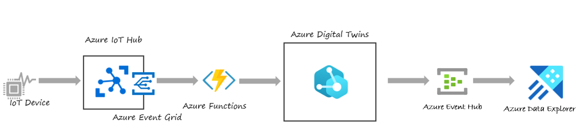

# Azure Digital Twin 실습 (Hands On Lab) 

## 실습 스토리

실습에서는 여러분이 초콜릿 공장의 라인 운영을 담당하고 있는 기술 전문가라고 가정을 합니다. 여러분은 공장의 작업자들이 여러 공정들(Fanning, Roasting, Grinding, Moulding)을 모니터링하는 실시간 대시보드를 만들기로 했습니다. 대시보드에서는 이런 질문들에 대한 답을 찾을 수 있습니다. 
* 지난 24시간 동안 Roasting 과정에서 온도가 섭씨 65도 아래로 내려간 시간
* 공장의 품질 기준에 맞추기 위한 그라인더의 2분 동안의 평균 진동값
* 지난 5일간 몰딩 온도가 정상보다 높아진 모든 이벤트 


또한 작업에 문제가 생길 때 원인을 분석하기 위하여 모든 데이터를 모아야 합니다. 

## 아키텍쳐 



## 사전준비 내용 
1. Azure 구독: 구독이 없으면 [체험계정 만들기](https://azure.microsoft.com/ko-kr/free/)
1. 실습용 노트북 준비: Windows 10 PC (또는 Linux / Mac 가능) + 개발환경 설치 
    * dkfsa
    * [.NET Core 3.1](https://dotnet.microsoft.com/download) 설치
    * [Visual Studio Code](https://code.visualstudio.com/) 설치
    * [VS Code C# Extension](https://marketplace.visualstudio.com/items?itemName=ms-dotnettools.csharp)
    * [VS Code Azure Function Extension](https://marketplace.visualstudio.com/items?itemName=ms-azuretools.vscode-azurefunctions)
    * [Git 설치](https://git-scm.com/downloads)
    * [Node.js 설치](https://nodejs.org/ko/download/)

## 클론 Github Repo 

원하는 디렉토리에 소스를 클론 합니다. 

``` bash
mkdir c:\users\username\repos
cd c:\users\username\repos
git clone https://github.com/Azure-Samples/digital-twins-samples/
```

## [Lab 1 Azure Digital Twin 만들기](lab1-adt-basic.md)

## [Lab 2 Azure Digital Twin Explorer 설정](lab2-setup-model.md)

## [Lab 3 ADT 모델 만들기](lab3-adt-model.md)

## [Lab 4 Function으로 이벤트 입력 ](lab4-ingest-event.md)

## [Lab 5 ADT에서 다른 환경으로 데이터 라우팅](lab5-adt-route.md)

## [Lab 6 Time Series Insights로 Visualize](lab6-visualize-tsi.md)