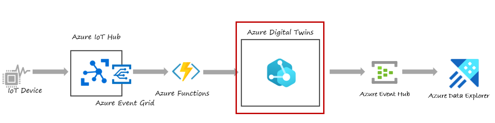
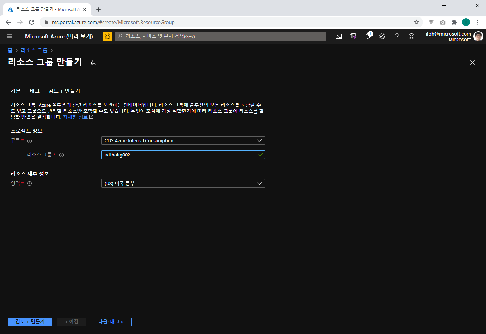
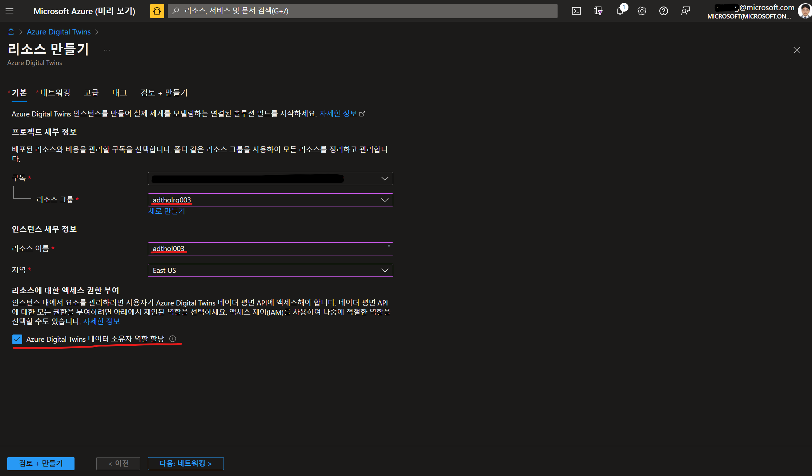
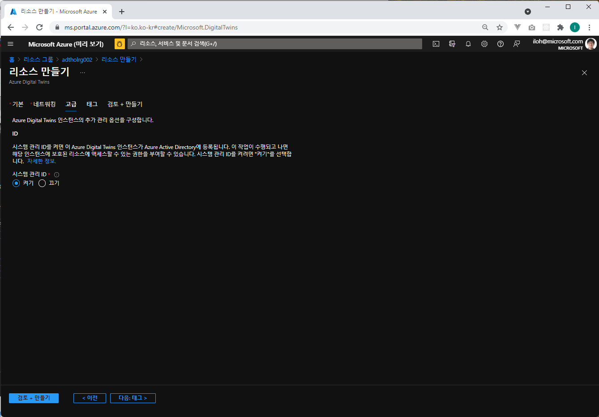

# Lab 1 Azure Digital Twin 만들기 (5분)

## 아키텍쳐 



## Azure Digital Twin 만들기 
[Azure 포탈](https://portal.azure.com)에 접속하여 Azure Digital Twin(ADT)를 만듭니다. 

### 리소스 그룹 만들기 

왼쪽의 전체 메뉴를 펼쳐서 "+ 리소스 만들기" 를 선택하고 "Resource Group"으로 검색해서 리소스 그룹을 원하는 이름으로 **미국 동부(East US)** 지역에 만듭니다. (예 adtholrg)




### Azure Digital Twins 만들기

왼쪽의 전체 메뉴를 펼쳐서 "+ 리소스 만들기" 를 선택하고 'Azure Digital Twin'으로 검색하거나 사물인터넷 메뉴에서 Azure Digtal Twin을 찾아 선택합니다. 


**미국 동부 (East US)** 같이 ADT가 있는 지역에 adthol003 등의 이름으로 Azure Digitla Twin 리소스를 만듭니다. (현재는 한국 데이터센터는 미지원)

"Azure Digital Twins 데이터 소유자 역할 담당"을 체크하면 리소스 생성시 자동으로 "Azure Digital Twins 데이터 소유자" 권한이 부여 됩니다.



Networking은 **Public endpoint (공용 액세스)**로 선택하고 **고급** 탭에서 **시스템 관리 ID 켜기**를 선택합니다. 



검토 + 만들기 탭에서 **만들기**를 선택합니다.  

## 클론 Github Repo

원하는 디렉토리에 소스를 클론 합니다. 

``` bash
mkdir c:\users\username\repos
cd c:\users\username\repos
git clone https://github.com/Azure-Samples/digital-twins-samples/
```

## Azure Digital Twin 모델링 

ADT 모델은 DTDL(Digital Twin Definition Language)로 작성하고 가장 간단한 ADT 모델 아래와 같습니다. 

``` json
{
  "@id": "dtmi:contosocom:DigitalTwins:Thermostat;1",
  "@type": "Interface",
  "@context": "dtmi:dtdl:context;2",
  "contents": [
    {
      "@type": "Property",
      "name": "Temperature",
      "schema": "double"
    }
  ]
}
```

실습에서는 초콜릿 공장을 시뮬레이션 하기위해 조금 더 복잡한 모델을 사용합니다. 모델은 github에서 받은 소스코드 중에 "digital-twins-samples/HandsOnLab/models" 폴더에 7개의 파일이 있습니다. 

* FactoryInterface.json
* FactoryFloorInterface.json
* ProductionLineInterface.json
* ProductionStepInterface.json
* ProductionStepGrinding.json 외 2개의 공정에 대한 Interface

## [Lab 2 Azure Digital Twin Explorer](lab2-setup-model.md)

## [실습 홈으로 가기](README.md)
