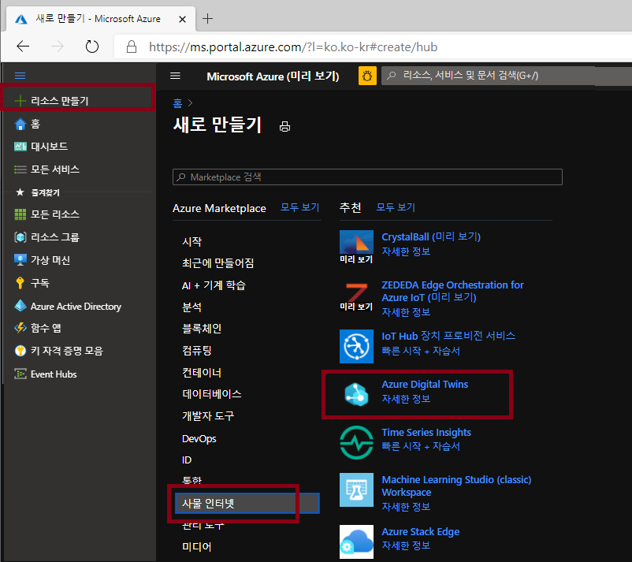
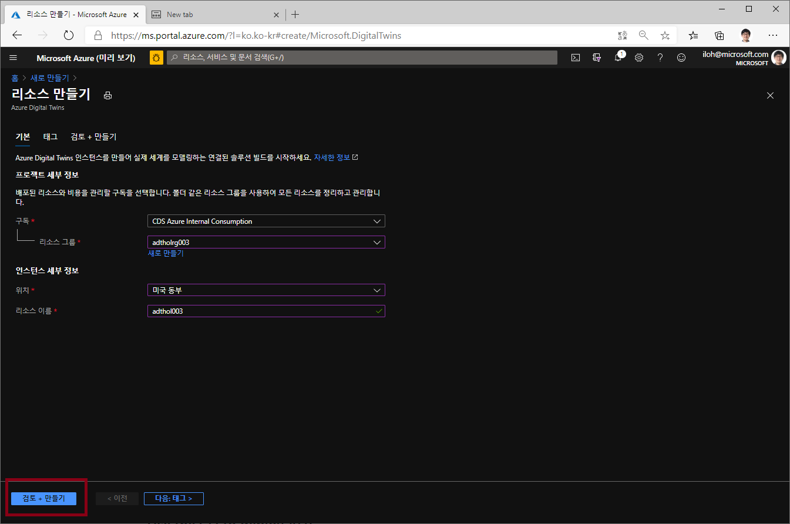

# Lab 1 Azure Digital Twin 만들기

## Azure Digital Twin 만들기 
Azure 포탈에 접속하여 Azure Digital Twin(ADT)를 만듭니다. 

### 리소스 그룹 만들기 

왼쪽의 전체 메뉴를 펼쳐서 "+ 리소스 만들기" 를 선택하고 리소스 그룹을 원하는 이름으로 **미국 동부(East US)** 지역에 만듭니다. (예 adtholrg)


### Azure Digital Twins 만들기

왼쪽의 전체 메뉴를 펼쳐서 "+ 리소스 만들기" 를 선택하고 'Azure Digital Twin'으로 검색하거나 사물인터넷 메뉴에서 Azure Digtal Twin을 찾아 선택합니다. 



**미국 동부 (East US)** 지역에 adthol003 등의 이름으로 Azure Digitla Twin 리소스를 만듭니다. 



### "Azure Digital Twin Owner" 권한 설정

방금 생성한 Azure Digital Twin으로 이동합니다. 


Azure Digital Twin 서비스의 설정 등을 수정하기 위하여 내 계정에 "Azure Digital Twin Owner" 권한 설정하기 위해 "액세스 제어(IAM)" 메뉴에서 "역할 할당" 탭의 추가 버튼을 누릅니다. **역할 할당 추가"** 를 선택합니다. 


역할 할당 추가 메뉴에서 역할을 "Azure Digital Twin 소유자"로 선택하고 사용자, 그룹 또는 서비스주체 중에서 내 이메일등으로 검색하여 선택하고 저장을 누릅니다. 

저장이 완료되면 역할 할당에 추가된 것을 확인합니다. 


## Azure Digital Twin 모델링 

ADT 모델은 DTDL(Digital Twin Definition Language)로 작성하고 가장 간단한 ADT 모델 아래와 같습니다. 

``` json
{
  "@id": "dtmi:contosocom:DigitalTwins:Thermostat;1",
  "@type": "Interface",
  "@context": "dtmi:dtdl:context;2",
  "contents": [
    {
      "@type": "Property",
      "name": "Temperature",
      "schema": "double"
    }
  ]
}
```

실습에서는 초콜릿 공장을 시뮬레이션 하기위해 조금 더 복잡한 모델을 사용합니다. 모델은 github에서 받은 소스코드 중에 "digital-twins-samples/HandsOnLab/models" 폴더에 5개의 파일이 있습니다. 

* FactoryInterface.json
* FactoryFloorInterface.json
* ProductionLineInterface.json
* ProductionStepInterface.json
* ProductionStepGrinding.json

## [Lab 2 Azure Digital Twin Explorer 설정](lab2-setup-model.md)

## [실습 홈으로 가기