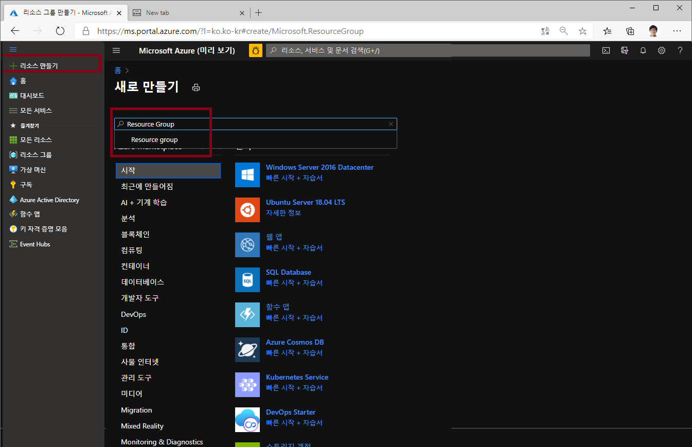
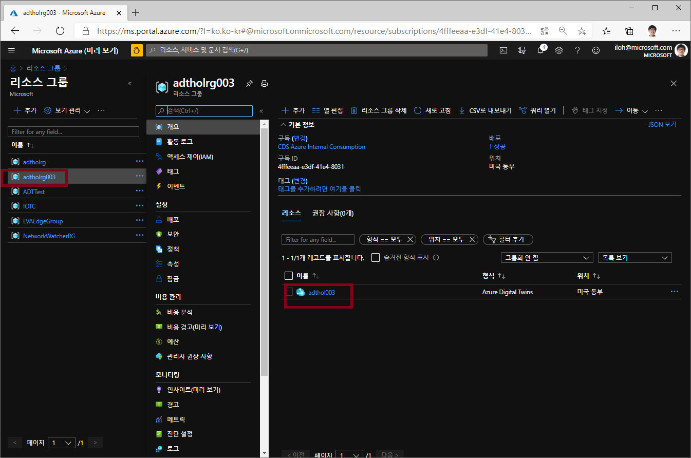
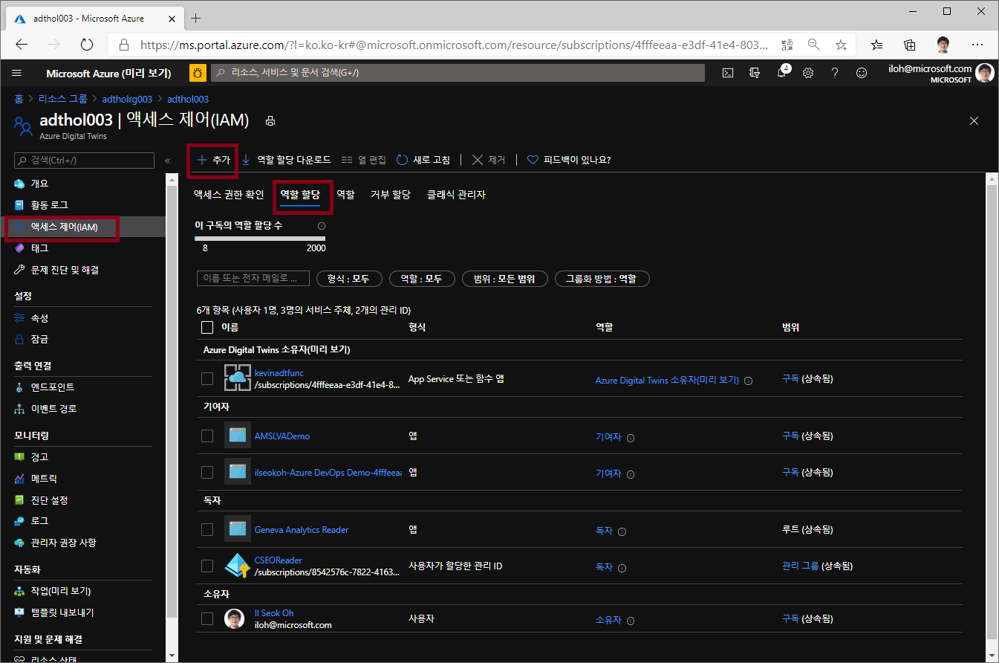

# Lab 1

## Azure Digital Twin 만들기 
Azure 포탈에 접속하여 Azure Digital Twin(ADT)를 만듭니다. 

### 리소스 그룹 만들기 

왼쪽의 전체 메뉴를 펼쳐서 "+ 리소스 만들기" 를 선택하고 리소스 그룹을 원하는 이름으로 **미국 동부(East US)** 지역에 만듭니다. (예 adtholrg)

### Azure Digital Twins 만들기

왼쪽의 전체 메뉴를 펼쳐서 "+ 리소스 만들기" 를 선택하고 'Azure Digital Twin'으로 검색하거나 사물인터넷 메뉴에서 Azure Digtal Twin을 찾아 선택합니다. 

**미국 동부 (East US)** 지역에 adthol003 등의 이름으로 Azure Digitla Twin 리소스를 만듭니다. 

### "Azure Digital Twin Owner" 권한 설정

방금 생성한 Azure Digital Twin으로 이동합니다. 

Azure Digital Twin 서비스의 설정 등을 수정하기 위하여 내 계정에 "Azure Digital Twin Owner" 권한 설정하기 위해 "액세스 제어(IAM)" 메뉴에서 "역할 할당" 탭의 추가 버튼을 누릅니다. 

