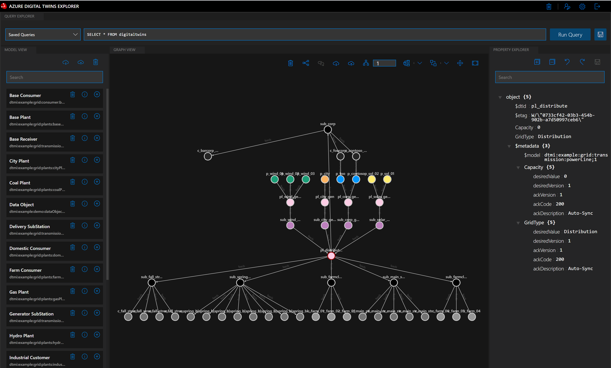
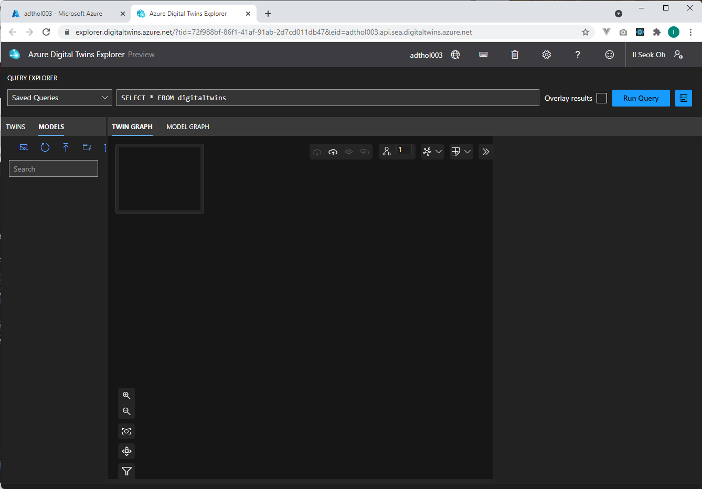
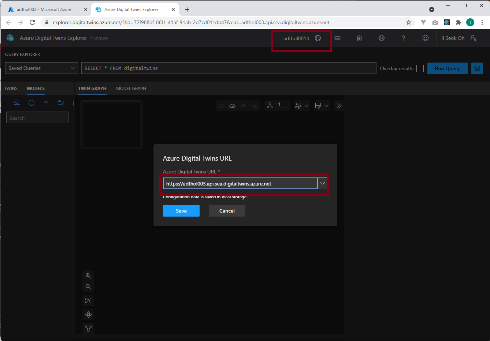
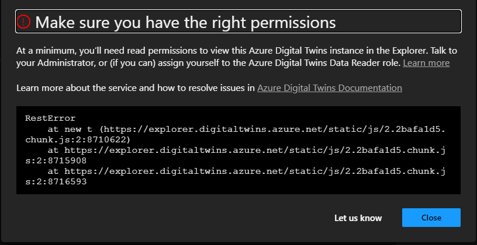
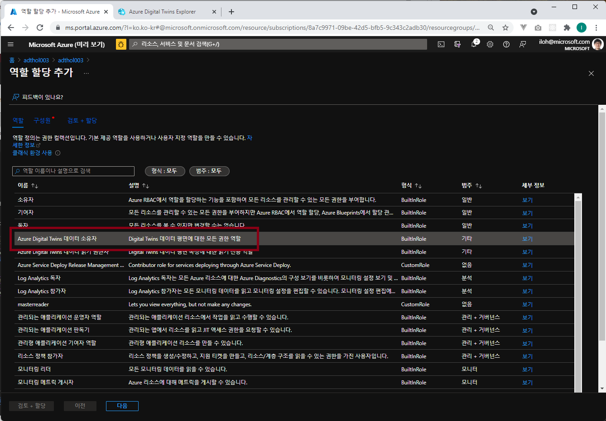

# Lab 2 - Azure Digital Twin Explorer (1분)

ADT 모델을 설정하는 방법은 여러가지가 있습니다. Azure CLI를 사용할 수도 있고 ADT REST API나 SDK를 사용할 수도 있습니다. 이 실습에서는 [Azure Digital Twin Explorer](https://github.com/Azure-Samples/digital-twins-explorer/tree/master/)을 사용하여 UI에서 모델을 업로드하고 설정을 하는 방법을 사용해보겠습니다. 

아직은 모델도 없고 Graph도 없습니다. 

## ADT Explorer 열기 

방금 만든 ADT 리소스로 이동하여 개요 메뉴에서 **Open Azure Digital Twins Explorer(미리보기)**를 클릭하여 ADT Explorer를 열어봅니다. 

## ADT Explorer URL 오류 발생시 조치 
 

URL 오류가 발생하면 Azure Portal 에서 https:// 를 포함한 URL을 복사합니다. 

ADT Explorer에 설정합니다. 

## ADT Explorer Permission 오류 발생시 조치 

Azure Digital Twin으로 이동합니다. 

Azure Digital Twin 서비스의 설정 등을 수정하기 위해서는 적절한 권한이 있어야 합니다. 내 계정에 "Azure Digital Twin Owner" 권한 설정하기 위해 "액세스 제어(IAM)" 메뉴에서 "역할 할당" 탭의 "+추가" 버튼을 누릅니다. **역할 할당 추가"** 를 선택합니다. 

역할 할당 추가 메뉴에서 역할을 "Azure Digital Twin 소유자"로 선택하고 사용자, 그룹 또는 서비스주체 중에서 내 이메일등으로 검색하여 선택하고 저장을 누릅니다. 

저장이 완료되면 역할 할당에 추가된 것을 확인합니다. 

ADT Explorer를 닫았다가 다시 열어봅니다. **다시 에러가 나면 로그아웃 했다가 다시 로그인** 합니다. 

## [Lab 3 ADT 모델 만들기](lab3-adt-model.md)

## [실습 홈으로 가기](README.md)