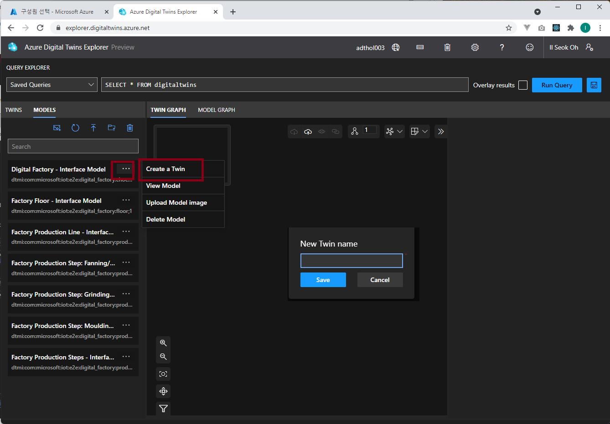

# Lab 3 - ADT 모델 만들기 (10분)

## 아키텍쳐 


## 모델 업로드

Lab 2의 ADT Explorer에 접속합니다. 

왼쪽 "Model View" 탭에서 3번째 아이콘 Upload Model 아이콘을 선택하고 Lab 1에서 받아놓은 소스코드에서 "digital-twins-samples/HandsOnLab/models' 폴더의 7개 json 파일을 모두 선택하여 업로드 합니다. 


모델이 정상적으로 업로드 된것을 확인합니다. 


## 모델 살펴보기 

모델은 [JSON-LD](https://json-ld.org/) 형식의 [DTDL](https://github.com/Azure/opendigitaltwins-dtdl) 로 만드는데 ADT의 모델에서 가장상위 타입은 Interface입니다. 

모델의 DTDL 내용은 json파일을 에디터로 열어서 볼 수 있습니다. ADT Explore에서도 각 모델에서 정보 아이콘을 눌려 확인 할 수 있습니다. 


우리가 만들려고 하는 초콜릿 공장은 "Digital Factory"를 가장 상위 모델로 시작해서 "Digital Factory"는 "Factory Floor"를 가지고 있고 다시 "Production Line"으로 구성되어 있습니다. 즉, 계층 구조를 가지고 있고 마지막 계층에는 "Production Step" 이 있는데 공정별로 "Fanning/Roasting", "Grinding/Crushing", "Moulding" 스텝이 있습니다. 

모델 설계에서는 각 공정별로 "Factory Production Step"을 만들고 각 스텝은 "Production Step"을 상속받는 구조로 되어 있습니다. 

각 모델 DTDL을 살펴보고 구조를 살펴봅니다. 모든 모델은 DTMI (Digital Twin Model ID)를 가지고 있는 것도 확인 합니다. DTDL에서 상속은 extends 속성으로 표현됩니다. 

## 트윈 인스턴스 만들기 

이제 트윈 인스턴스를 만듭니다. 모델과 트윈 인스턴스는 마치 객체지향프로그래밍(OOP)에서 클래스(class)와 인스턴스(instance)의 관계와 같습니다. 클래스를 new 해서 인스턴스를 만들듯이 업로드 한 모델에서 여러개의 트윈 인스턴스를 생성할 수 있습니다. 

역시 여러가지 방법(Azure CLI, REST API, SDK)으로 인스턴스를 생성할 수 있지만 ADT Explorer를 이용해서 인스턴스를 만들어 보겠습니다. 

업로드 한 모델에서 플러스 아이콘을 클릭하면 "New Twin Name" 입력 창이 뜹니다. 여기에 트윈 이름을 입력하면 됩니다. 



아래 모델 ID(DTMI) - 트윈이름을 참조하여 모델별로 "+" 아이콘을 클릭하여 트윈 인스턴스 4개를 만듭니다. 

* dtmi:com:microsoft:iot:e2e:digital_factory:chocolate_factory;1 - **ChocolateFactory**
* dtmi:com:microsoft:iot:e2e:digital_factory:floor;1 - **FactoryFloor**
* dtmi:com:microsoft:iot:e2e:digital_factory:production_line;1 - **ProductionLine**
* dtmi:com:microsoft:iot:e2e:digital_factory:production_step_grinding;1 - **GrindingStep**


## 관계 만들기 

모델 인스턴스 간의 관계를 만들어 줍니다. 모델에는 relationship 타입으로 모델간의 관계가 정의되어 있습니다. 예를들어 초콜릿 공장은 'rel_has_floors' 라는 이름의 realationship 이 정의되어 있습니다. 


이 관계를 이용해서 트윈 인스턴스 간의 관계를 맺어줍니다. ADT Explore에서는 From 인스턴스를 클릭하고 Ctrl 키를 누른채 to 인스턴스를 클릭한 후 오른쪽 마우스 클릭하여 "Add Relationship" 메뉴를 클릭합니다. 


"Create Relationship" 창에서 올바른 Relationship을 찾아서 설정하고 save를 누릅니다. 아래 예에서는 ChocolateFactory가 FactoryFloor를 has 하는 관계를 만들어 줍니다. 


아래 내용을 참고하여 관계를 만들어줍니다. 

* ChocolateFactory - rel_has_floors - FactoryFloor
* FactoryFloor - rel_runs_lines - ProductionLine
* ProductionLine - rel_runs_steps - GrindingStep


## 모두 삭제하기

ADT Explorer 에서 관계 및 트윈을 삭제 할 수 있습니다. 관계를 나타내는 선에서 마우스 오른쪽 클릭을 하거나 트윈에서 마우스 오른쪽 클릭을 하면 삭제 메뉴를 볼 수 있습니다. 


애써 만들었지만 **트윈과 관계 모두 삭제**합니다. 관계를 모두 선택하여 삭제하고 그 다음 트윈을 선택해서 삭제합니다. Run Query를 누르면 모두 삭제했는지 확인 할 수 있습니다. import 메뉴를 통해서 한꺼번에 다시 생성하겠습니다. 

## import 메뉴로 한번에 생성

만들어야 하는 트윈과 관계의 갯수가 많아지면 ADT Explorer로 하나하나 만들기가 어렵습니다. 수정할 때 또한 쉽지 않습니다. 엑셀파일([chocolate-factory.xlsx](./chocolate-factory.xlsx))을 이용해서 Import 하는 방법을 이용하면 반복 수행하기가 쉽습니다. 이 방법을 이용하면 초가값 또한 한번에 입력 가능합니다. 

```
TIP. 트윈의 속성을 초기화 해야 합니다. Lat 4 에서 디지털 트윈의 속성을 업데이트 할 때 초기값이 없으면 오류가 발생합니다. 
```

엑셀 포멧은 아래 그림과 같습니다. 


 * ModelID : 트윈을 생성할 모델 ID를 입력합니다. 
 * ID (must be unique): 트윈 ID, 유일한 이름으로 생성해야 합니다. 
 * Relationship (From): 부모 트윈 ID
 * Relationship Name: DTDL의 Relationship 이름 
 * Init Data: DTDL 에 있는 속성의 초기값 (Json)

ADT Explorer에서 엑셀 파일을 Import 하는 메뉴는 Twin Graph 화면의 상단에 있습니다. 엑셀 파일을 지정 후 저장 합니다. 


## 트윈 쿼리 

ADT Explorer 에서 트윈 쿼리를 테스트 할 수 있습니다. 결과는 Twin Graph 화면에 표시되지만 특정 값을 조회하는 경우는 Output 창을 활요하는게 좋습니다. Output 창으로는 쿼리 결과에 대한 전체 내용을 볼 수 있습니다. 

ADT Explorer에서 상단의 설정 버튼을 누르고 Output을 설정하면 Output 창을 활성화 할 수 있습니다. 


### 1. 모든 트윈
```sql
SELECT * FROM digitaltwins
```
모든 트윈과 관계를 조회 합니다. 

### 2. Model ID로 조회
```sql
SELECT * FROM digitaltwins 
WHERE IS_OF_MODEL('dtmi:com:microsoft:iot:e2e:digital_factory:production_step;2')
```
IS_OF_MODEL 함수를 이용해서 조회 가능합니다. 

### 3. 속성 값으로 비교 조회
```sql
SELECT * FROM digitaltwins 
WHERE IS_OF_MODEL('dtmi:com:microsoft:iot:e2e:digital_factory:production_step;2') 
AND ChasisTemperature > 70
```
속성 값으로 비교 조회 가능합니다. 

### 4. JOIN 
```sql
SELECT Parent FROM digitaltwins Parent 
JOIN Child RELATED Parent.rel_runs_steps
WHERE Child.$dtId = 'MouldingStep'
```
트윈 ID($dtId)와 부모 관계를 이용하여 조회 가능합니다. 
MouldingStep 이라는 트윈 ID를 가진 트윈과 rel_runs_steps 관계로 이어진 부모 트윈

### 5. 속성 값 조회
```sql
SELECT Parent.LineId FROM digitaltwins Parent 
JOIN Child RELATED Parent.rel_runs_steps
WHERE Child.$dtId = 'MouldingStep'
```
MouldingStep 이라는 트윈 ID를 가진 트윈과 rel_runs_steps 관계로 이어진 부모 트윈의 LineName 속성값 조회
속성 값은 Output 창에서 확인 가능합니다. 

기타 쿼리에 대한 상세 내용은 [Azure Digital Twins 쿼리 언어](https://docs.microsoft.com/ko-kr/azure/digital-twins/concepts-query-language) 문서를 참조하세요.

## [Lab 4 Function으로 이벤트 입력 ](lab4-ingest-event.md)

## [실습 홈으로 가기](README.md)