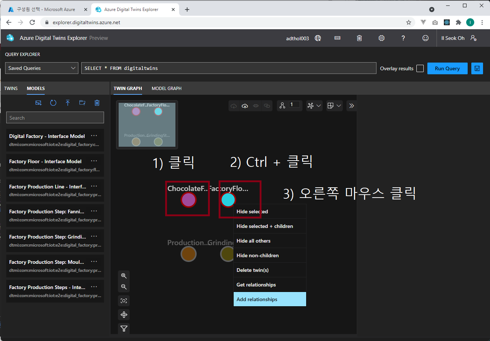

# Lab 3 - ADT 모델 만들기 (10분)

## 모델 업로드

Lab 2의 ADT Explorer를 실행하여 http://localhost:3000으로 접속합니다. 

왼쪽 "Model View" 탭에서 3번째 아이콘 Upload Model 아이콘을 선택하고 Lab 1에서 받아놓은 소스코드에서 "digital-twins-samples/HandsOnLab/models' 폴더의 6개 json 파일을 모두 선택하여 업로드 합니다. 

모델이 정상적으로 업로드 된것을 확인합니다. 

## 모델 살펴보기 

모델은 [JSON-LD](https://json-ld.org/) 형식의 [DTDL](https://github.com/Azure/opendigitaltwins-dtdl) 로 만드는데 ADT의 모델에서 가장상위 타입은 Interface입니다. 

모델의 DTDL 내용은 json파일을 에디터로 열어서 볼 수 있습니다. ADT Explore에서도 각 모델에서 정보 아이콘을 눌려 확인 할 수 있습니다. 

우리가 만들려고 하는 초콜릿 공장은 "Digital Factory"를 가장 상위 모델로 시작해서 "Digital Factory"는 "Factory Floor"를 가지고 있고 다시 "Production Line"으로 구성되어 있습니다. 즉, 계층 구조를 가지고 있고 마지막 계층에는 "Production Step" 이 있는데 공정별로 "Fanning/Roasting", "Grinding/Crushing", "Moulding" 스텝이 있습니다. 

모델 설계에서는 각 공정별로 "Factory Production Step"을 만들고 각 스텝은 "Production Step"을 상속받는 구조로 되어 있습니다. 

각 모델 DTDL을 살펴보고 구조를 살펴봅니다. 모든 모델은 DTMI (Digital Twin Model ID)를 가지고 있는 것도 확인 합니다. DTDL에서 상속은 extends 속성으로 표현됩니다. 

## 트윈 인스턴스 만들기 

이제 트윈 인스턴스를 만듭니다. 모델과 트윈 인스턴스는 마치 객체지향프로그래밍(OOP)에서 클래스(class)와 인스턴스(instance)의 관계와 같습니다. 클래스를 new 해서 인스턴스를 만들듯이 업로드 한 모델에서 여러개의 트윈 인스턴스를 생성할 수 있습니다. 

역시 여러가지 방법(Azure CLI, REST API, SDK)으로 인스턴스를 생성할 수 있지만 ADT Explorer를 이용해서 인스턴스를 만들어 보겠습니다. 

업로드 한 모델에서 플러스 아이콘을 클릭하면 "New Twin Name" 입력 창이 뜹니다. 여기에 트윈 이름을 입력하면 됩니다. 

아래 모델 ID(DTMI) - 트윈이름을 참조하여 트윈 인스턴스 4개를 만듭니다. 

* dtmi:com:microsoft:iot:e2e:digital_factory:chocolate_factory;1 - **ChocolateFactory**
* dtmi:com:microsoft:iot:e2e:digital_factory:floor;1 - **FactoryFloor**
* dtmi:com:microsoft:iot:e2e:digital_factory:production_line;1 - **ProductionLine**
* dtmi:com:microsoft:iot:e2e:digital_factory:production_step_grinding;1 - **GrindingStep**

## 관계 만들기 

모델 인스턴스 간의 관계를 만들어 줍니다. 모델에는 relationship 타입으로 모델간의 관계가 정의되어 있습니다. 예를들어 초콜릿 공장은 'rel_has_floors' 라는 이름의 realationship 이 정의되어 있습니다. 

이 관계를 이용해서 트윈 인스턴스 간의 관계를 맺어줍니다. ADT Explore에서는 From 인스턴스를 클릭하고 Ctrl 키를 누른채 to 인스턴스를 클릭한 후 Graph view 상단의 "Add Relationship" 아이콘이 활성화 되면 클릭합니다. 

"Create Relationship" 창에서 올바른 Relationship을 찾아서 설정하고 save를 누릅니다. 아래 예에서는 ChocolateFactory가 FactoryFloor를 has 하는 관계를 만들어 줍니다. 

아래 내용을 참고하여 관계를 만들어줍니다. 

* ChocolateFactory - rel_has_floors - FactoryFloor
* FactoryFloor - rel_runs_lines - ProductionLine
* ProductionLine - rel_runs_steps - GrindingStep

## [Lab 4 Function으로 이벤트 입력 ](lab4-ingest-event.md)

## [실습 홈으로 가기](README.md)