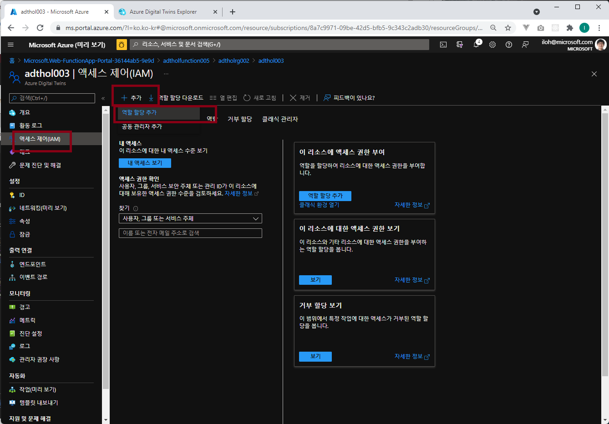
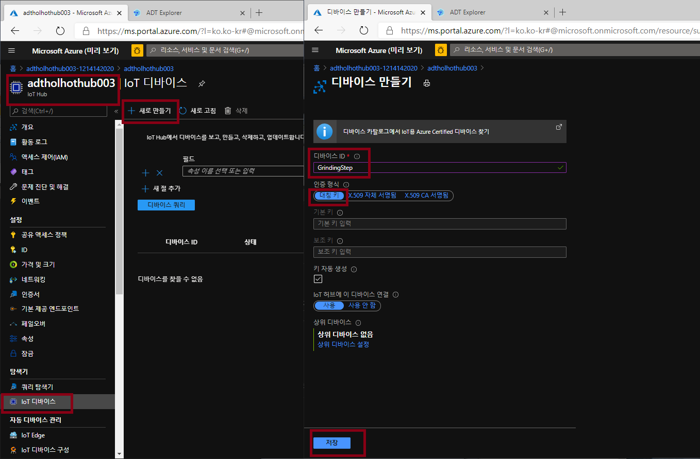
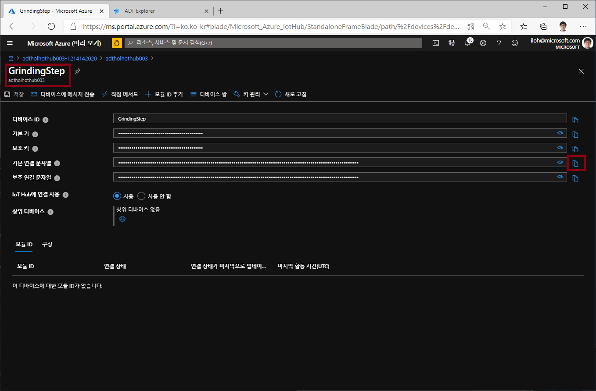

# Lab 4 Function으로 이벤트 입력 (25분)

이제 Azure funtion과 같은 외부 Compute리소스에 Azure Digital Twin으로 데이터를 보내야 합니다. IoT Hub와 같은 곳에서 받은 데이터를 Digital Twin SDK 등을 통해서 ADT의 속성을 업데이트 할 수 있습니다. 

## 아키텍쳐 


## Azure Function 만들기 

### 포탈에서 Azure Function App 만들기 

작업하고 있는 리소스그룹에 Azure Function App을 만들기 위해서 다시 Azure 포탈의 왼쪽 위 메뉴에서 "리소스만들기" 선택하고 "함수앱"을 선택합니다. 


함수 앱 만들기에서 구독을 정확히 선택하고 작업중인 리소스 그룹을 선택합니다. 아래 값들을 설정하고 "검토 + 만들기"를 클릭합니다. 

* 함수앱 이름: 예) adtholfunction003
* 게시: 코드 
* 런타임 스택: .NET
* 버전: 6
* 지역: East US


만들기를 클릭하여 Function 앱을 만듭니다. 


## Function에서 ADT에 접근하도록 권한 설정 

Azure Function의 코드가 Azure Digital Twin에 접근하려면 보안 토근을 통해 인증을 해야 합니다. 여기에서는 [Managed Service Identity (MSI)](https://docs.microsoft.com/ko-kr/azure/active-directory/managed-identities-azure-resources/overview)를 Function 앱에 설정하여 사용해보겠습니다. 

Azure Portal에서 system-managed identity를 만들고 Function App의 identity를 *Azure Digital Twin Data Owner* 역할을 할당합니다. 이렇게 하면 Managed Identity는 Function 앱에 권한을 부여하여 ADT에 접근 할 수 있도록 합니다. 

### Function 에 System-managed Identity 사용 활성화

이전 스텝에서 생성한 Azure Function으로 접속합니다. "ID" 메뉴를 선택하여 아래와 같이 "시스템 할당항목"(System-managed identity)에서 상태를 "켜기"로 변경하고 저장을 클릭합니다. 


### ADT에서 Azure Function에 권한 추가

이번에는 Azure Digital Twin으로 가서 "액세스 제어(IAM)" 메뉴에서 "역할 할당 추가" 버튼을 누르고 아래 그림과 같이 설정하고 저장을 클릭합니다.  

* 역할: Azure Digital Twin 소유자
* 다음에 대한 액세스 할당: 함수앱
* 구독: 사용중인 구독 선택
* 선택: 생성한 함수앱 선택 




### Azure Function 환경변수 설정

Azure Digital Twin의 URL을 Function의 환경변수에 설정해줍니다. Azure Function에서 "구성" 메뉴를 선택하고 "+ 새 애플리케이션 설정"을 클릭하고 아래 그림과 같이 ADT_SERVICE_URL 을 Azure Digital Twin의 호스트 이름에 https:// 를 붙여서 설정해 줍니다. 

* 이름: ADT_SERVICE_URL
* 값: https:// digital twin url


그리고 반드시 저장을 클릭해서 저장합니다. 


## Visual Studio Code로 Azure Function App 만들기 

이번에는 Visual Studio Code를 이용하여 로컬 개발 환경에서 Azure Function 프로젝트를 만듭니다. 이 Function은 EventGrid에 의해서 트리거 됩니다. 

1. Visual Studio Code를 실행하고 아래 그림처럼 Azure에 로그인 되어 있는지 확인합니다. 


- 계정을 변경하려면:
    - VS Code command pallet(Ctrl+Shift+P)를 열어서 Azure: Sign out 를 입력하고
    - Azure: Sign in 를 실행합니다. 

    

1. 왼쪽 Activity 바에서 Azure 아이콘을 선택하고  **Azure: Functions** 영역에서  **Create new project...** 아이콘을 선택합니다.

    

1. 프로젝트워크 스페이스로 사용할 적절한 디렉토리를 지정하고 **Select**를 선택합니다.

>[!NOTE]
>디렉토리는 비어 있거나 새로 만들어야 합니다.
>

1. VSCode 프롬프트에 아래 정보를 선택하거나 입력합니다.

    - **Select a language for your function project**: `C#` 선택.
    - **Select a .NET runtime**: .NET Core 3
    - **Select a template for your project's first function**: Azure Event Grid Trigger
    - **Provide a function name**: `TwinsFunction` 입력.
    - **Provide a namespace**: `My.Function` 입력.
    - **When prompted for a storage account choose**: Skip for now
    - **Select how you would like to open your project**: `Add to workspace` 선택.

## Install Nuget Package

Visual Studio Code 터미널(Terminal > New Termianl)에서 아래 명령을 이용하여 필요한 Nuget 패키지를 설치합니다. (VSCode Terminal 단축키 Ctrl + `(백틱) )


```dos
    dotnet add package Azure.DigitalTwins.Core
    dotnet add package Azure.identity
    dotnet add package System.Net.Http
```

## Event Grid 트리거 Azure Function 코딩 

이제 ADT SDK를 이용해서 코드를 작성하여 디지털 트윈을 업데이트 합니다. 

1. VS Code에서 TwinsFunction.cs을 열고
1. 아래 코드를 탬플릿에 맞춰서 넣어줍니다. 

>[!TIP]
>namespace와 function 이름이 같아야 합니다. 이전 단계에서 다른 이름을 사용했다면 같은 이름을 사용해야 합니다. 

```csharp
using Azure;
using Azure.Core.Pipeline;
using Azure.DigitalTwins.Core;
using Azure.Identity;
using Microsoft.Azure.EventGrid.Models;
using Microsoft.Azure.WebJobs;
using Microsoft.Azure.WebJobs.Extensions.EventGrid;
using Microsoft.Extensions.Logging;
using Newtonsoft.Json;
using Newtonsoft.Json.Linq;
using System;
using System.Net.Http;
using System.Threading.Tasks;

namespace My.Function
{

    public class TwinsFunction
    {
        //Your Digital Twin URL is stored in an application setting in Azure Functions
        private static readonly string adtInstanceUrl = Environment.GetEnvironmentVariable("ADT_SERVICE_URL");
        private static readonly HttpClient httpClient = new HttpClient();

        [FunctionName("TwinsFunction")]
        public async Task Run([EventGridTrigger] EventGridEvent eventGridEvent, ILogger log)
        {
            log.LogInformation(eventGridEvent.Data.ToString());
            if (adtInstanceUrl == null) log.LogError("Application setting \"ADT_SERVICE_URL\" not set");
            try
            {
                //Authenticate with Digital Twins
                var cred = new DefaultAzureCredential();
                DigitalTwinsClient client = new DigitalTwinsClient(new Uri(adtInstanceUrl), cred);
                log.LogInformation($"ADT service client connection created.");
                
                if (eventGridEvent != null && eventGridEvent.Data != null)
                {
                    log.LogInformation(eventGridEvent.Data.ToString());

                    // Reading deviceId and temperature for IoT Hub JSON
                    JObject deviceMessage = (JObject)JsonConvert.DeserializeObject(eventGridEvent.Data.ToString());
                    string deviceId = (string)deviceMessage["systemProperties"]["iothub-connection-device-id"];
                    string deviceType = (string)deviceMessage["body"]["DeviceType"];
                    log.LogInformation($"Device:{deviceId} DeviceType is:{deviceType}");
                     var updateTwinData = new JsonPatchDocument();
                    switch (deviceType){
                        case "FanningSensor":
                            updateTwinData.AppendAdd("/ChasisTemperature", deviceMessage["body"]["ChasisTemperature"].Value<double>());
                            updateTwinData.AppendAdd("/FanSpeed", deviceMessage["body"]["Force"].Value<double>());
                            updateTwinData.AppendAdd("/RoastingTime", deviceMessage["body"]["RoastingTime"].Value<int>());
                            updateTwinData.AppendAdd("/PowerUsage", deviceMessage["body"]["PowerUsage"].Value<double>());
                            await client.UpdateDigitalTwinAsync(deviceId, updateTwinData);
                        break;
                        case "GrindingSensor":
                            updateTwinData.AppendAdd("/ChasisTemperature", deviceMessage["body"]["ChasisTemperature"].Value<double>());
                            updateTwinData.AppendAdd("/Force", deviceMessage["body"]["Force"].Value<double>());
                            updateTwinData.AppendAdd("/PowerUsage", deviceMessage["body"]["PowerUsage"].Value<double>());
                            updateTwinData.AppendAdd("/Vibration", deviceMessage["body"]["Vibration"].Value<double>());
                            await client.UpdateDigitalTwinAsync(deviceId, updateTwinData);
                        break;
                        case "MouldingSensor":
                            updateTwinData.AppendAdd("/ChasisTemperature", deviceMessage["body"]["ChasisTemperature"].Value<double>());
                            updateTwinData.AppendAdd("/PowerUsage", deviceMessage["body"]["PowerUsage"].Value<double>());
                            await client.UpdateDigitalTwinAsync(deviceId, updateTwinData);
                        break;
                    }

                }
            }
            catch (Exception e)
            {
                log.LogError(e.Message);
            }

        }
    }

}
```

## Azure Function 배포 

1. VSCode function extension에서 **Deploy to Function App...**을 선택합니다. 

    

- **Select subscription**: 실습에 사용중인 구독을 선택합니다. 
- **Select Function App in Azure**: 이전 스텝에서 만들어 놓은 Function 이름을 선택합니다. `adtholfunction003`.

1. 배포가 완료되면 아래 그림과 같이 Start Streaming Logs 창이 뜹니다.
  
1. **Stream Logs** 를 선택하면 다음 단계를 진행한 후에 Azure Function의 로그를 확인 할 수 있습니다. 다음 단계에서 IoT Hub를 설정하고 디바이스에서 메시지를 보내야 로그를 확인 할 수 있습니다. 
1. *enable appication logging*,  Yes를 선택합니다. 
    
1. 다른 방법으로는 VS Code 에서 Azure Function을 찾아 오른쪽 클릭 후 **Start Streaming Logs**를 선택하면 됩니다.
  
  
  
## IoT Hub 셋업 

IoT 디바이스가 보내는 데이터는 IoT Hub를 통해서 디지털 트윈으로 입력됩니다. 이번에는 IoT Hub를 만들고 디바이스가 보내는 데이터를 Event Grid로 보내도록 설정합니다. 

Azure Portal에서 다시 "+리소스 만들기"를 선택한 후 "사물 인터넷"탭에서 IoT Hub를 찾아서 선택합니다. "검토 + 만들기" 버튼을 눌러 IoT Hub를 생성합니다. 


* 구독: 실습에 사용하는 구독 선택
* 리소스 그룹: 실습에 사용하는 리소스 그룹 선택
* 지역: 미국동부
* IoT Hub이름: 예) adtholhothub003


## IoT Hub에 디바이스를 하나 만들어줍니다. 

> [!Note] Azure function에서는 여기서 만드는 디바이스 아이디와 트윈 아이디가 같다는 가정으로 코드가 작성되어 있습니다. 따라서 디바이스 아이디를 GrindingStep 으로 설정한 후 변경하지 않도록 합니다.

* 디바이스 ID: GrindingStep
* 인증형식: 대칭키 
* 키 자동생성: 체크 
* IoT Hub에 이 디바이스 연결: 사용 



생성된 후 생성된 디바이스 아이디를 클릭하여 Device Connection String을 저장해 둡니다. 



Device Connection String은 이런 형식 입니다. 

```
HostName=<iothub 이름>.azure-devices.net;DeviceId=GrindingStep;SharedAccessKey=AzDGfpvfYDPN3Vpw3fs12fpOdslH3CgTn8s9zx6ImE=
```

## IoT Hub에서 Event Grid 설정

이번에는 IoT Hub에서 이벤트를 발생하도록 설정합니다. 

Azure 포탈에서 IoT Hub로 들어갑니다. "이벤트" 메뉴를 선택하고 "+이벤트 구독"을 클릭합니다. 아래와 같이 정보를 입력하고 만들기를 클릭합니다. 


* 이벤트 구독정보 이름: IoTHubEvents
* 이벤트 스키마: Event Grid 스키마
* 시스템 토픽 이름: adtholiothub003
* 이벤트 형식 필터링: Device Telemetry 만 선택
* 엔트포인트 유형: Azure 함수 
* 엔트포인트: 엔드포인트 선택 누름. 이전 스템에서 만든 Azure Function을 선택해 줍니다.  (구독, 리소스그룹, 합수앱, 슬롯, 기능(TwinsFunction) 선택)

"만들기"를 선택합니다. 


## 시뮬레이션 디바이스에서 데이터 보내기


1. Github에서 받은 샘플 소스코드에서 "digital-twins-samples\HandsOnLab\SimulatedClient\Sensor.js"를 Visual Studio Code 등으로 오픈합니다. 
1. 코드에서 **const deviceConnectionString = ""** 을 찾아서 이전에 만든 IoT Hub 디바이스의 Connection String을 입력합니다. 

!

>[!NOTE]
>디바이스 Connection String은 Azure 포탈 IoT Hub에서 "IoT Device"메뉴에서 "GrindingStep" 디바이스를 선택하면 확인할 수 있습니다. 


1. PowerShell(또는 Linux/Mac 에서는 Bash)를 열어서 "digital-twins-samples\HandsOnLab\SimulatedClient\" 폴더로 이동합니다. 아래 명령으로 시뮬레이터를 실행합니다. 

    ```Azure CLI
    cd C:\Users\username\repos\digital-twins-samples\handsonlab\SimulatedClient
    npm install
    node ./Sensor.js
    ```


1. 시뮬레이션 디바이스가 메시지를 보내기 시작합니다. 

여기에서 이전 단계의 Azure Function 만든 후에 열어 두었던 Log Stream에 시뮬레이션 디바이스가 보낸 메시지 처리에 대한 로그를 확인 할 수 있습니다. 이 로그는 메시지가 IoT Hub를 거쳐 Event Grid로 보내진 메시지를 Azure Function이 받아서 처리하는 내용입니다. 

   

## (**옵션**) Azure CLI 로 디지털 트윈 데이터 확인

1. Azure Function까지 데이터가 전달되는 것을 확인 했으니 Azure Digital Twin에서도 데이터가 전달되는지 확인할 수 있습니다. [Azure CLI를 설치](https://docs.microsoft.com/en-us/cli/azure/install-azure-cli)하고 azure IoT Extention을 설치한 후 아래 명령을 실행합니다.  

```azurecli
az login
az account show
az account set -s <subscription id>
az extension list
az extension add --name azure-iot
az extension update --name azure-iot
```

```azurecli
az dt twin show -n <adt name> --twin-id GrindingStep
```


## [Lab 5 ADT에서 다른 환경으로 데이터 라우팅](lab5-adt-route.md)

## [실습 홈으로 가기](README.md)
