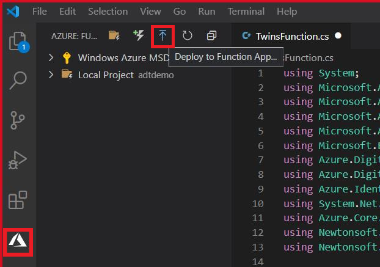

# Lab 4 Function으로 이벤트 입력 


We can ingest data into Azure Digital Twins through external compute resources, such as an Azure Function, that receives the data and uses the Digital Twins SDK to set properties.

## Azure Function 만들기 

1. Create a Azure storage account

    ```azurecli
    az storage account create --name $functionstorage --location $location --resource-group $rgname --sku Standard_LRS
    ```

1. Create an Azure Function

    ```azurecli
    az functionapp create --resource-group $rgname --consumption-plan-location $location --name $telemetryfunctionname --storage-account $functionstorage --functions-version 3
    ```

## Function에서 ADT에 접근하도록 권한 설정 

An Azure function requires a security token in order to authenticate with Azure Digital Twins. To make sure that this token is passed, you'll need to create a [Managed Service Identity (MSI)](../active-directory/managed-identities-azure-resources/overview.md) for the function app.

In this section, we'll create a system-managed identity and assign the function app's identity to the *Azure Digital Twins Data Owner* role for your Azure Digital Twins instance. The Managed Identity gives the function app permission in the instance to perform data plane activities. We'll also provide the the URL of Azure Digital Twins instance to the function by setting an environment variable.

1. Use the following command to create the system-managed identity. We'll also store the _principalId_ field in the a variable for use later.

    ```azurecli
    $principalID = $(az functionapp identity assign -g $rgname -n $telemetryfunctionname  --query principalId)
    ```

1. Use the _principalId_ value in the following command to assign the function app's identity to the _Azure Digital Twins Data Owner_ role for your Azure Digital Twins instance.

    ```azurecli	
    az dt role-assignment create --dt-name $dtname --assignee $principalID --role "Azure Digital Twins Data Owner"
    ```

1. Lastly, set the URL of your Azure Digital Twins as an environment variable

> [!TIP]
> The Azure Digital Twins instance's URL is made by adding *https://* to the beginning of your Azure Digital Twins instance's *hostName* which you retrieved earlier.
> You'll need to edit the command below in notepad and add the FULL url before pasting

```azurecli
   az functionapp config appsettings set -g $rgname -n $telemetryfunctionname --settings "ADT_SERVICE_URL=https://<your-Azure-Digital-Twins-instance-hostname>"
```

## Visual Studio Code로 Azure Function App 만들기 

In this section, you use Visual Studio Code to create a local Azure Functions project in your chosen language. The function will be triggered by EventGrid.

1. Ensure you are signed into Azure using the correct account by examining the logon at the lower-right

- If you need to change your account:
    - Bring up the VS Code command pallet(Ctrl+Shift+P) and enter Azure: Sign out
    - Then run Azure: Sign in
    

1. Choose the Azure icon in the Activity bar, then in the **Azure: Functions** area, select the **Create new project...** icon.

    

1. Choose a directory location for your project workspace and choose **Select**.

>[!NOTE]
>This directoy should be new, empty, and unique for this Azure Function
>

1. Provide the following information at the prompts:
    - **Select a language for your function project**: Choose `C#`.
    - **Select a template for your project's first function**: Choose `Change template filter`.
    - **Select a template filter**: Choose All
    - **Select a template for your project's first function**: Choose `EventGridTrigger`.
    - **Provide a function name**: Type `TwinsFunction`.
    - **Provide a namespace**: Type `My.Function`.
    - **When prompted for a storage account choose**: Skip for now
    - **Select how you would like to open your project**: Choose `Add to workspace`.

## Install Nuget Package

In the Visual Studio Code Terminal, add the required Nuget packages by typing the following commands:

```dos
    dotnet add package Azure.DigitalTwins.Core --version 1.0.0
    dotnet add package Azure.identity --version 1.2.2
    dotnet add package System.Net.Http
```

## Event Grid 트리거 Azure Function 코딩 

Now we'll add code that uses the ADT SDK to update a digital twin.

1. In VS Code, open the file TwinsFunction.cs
1. Replace the code in the Function App template with the sample provided:

>[!TIP]
>The namespace and function name must match.  If you changed them in the previous steps, make sure to do the same in the code sample.

```csharp
using Azure;
using Azure.Core.Pipeline;
using Azure.DigitalTwins.Core;
using Azure.Identity;
using Microsoft.Azure.EventGrid.Models;
using Microsoft.Azure.WebJobs;
using Microsoft.Azure.WebJobs.Extensions.EventGrid;
using Microsoft.Extensions.Logging;
using Newtonsoft.Json;
using Newtonsoft.Json.Linq;
using System;
using System.Net.Http;

namespace My.Function
{

    public class TwinsFunction
    {
        //Your Digital Twin URL is stored in an application setting in Azure Functions
        private static readonly string adtInstanceUrl = Environment.GetEnvironmentVariable("ADT_SERVICE_URL");
        private static readonly HttpClient httpClient = new HttpClient();

        [FunctionName("TwinsFunction")]
        public async void Run([EventGridTrigger] EventGridEvent eventGridEvent, ILogger log)
        {
            log.LogInformation(eventGridEvent.Data.ToString());
            if (adtInstanceUrl == null) log.LogError("Application setting \"ADT_SERVICE_URL\" not set");
            try
            {
                //Authenticate with Digital Twins
                ManagedIdentityCredential cred = new ManagedIdentityCredential("https://digitaltwins.azure.net");
                DigitalTwinsClient client = new DigitalTwinsClient(new Uri(adtInstanceUrl), cred, new DigitalTwinsClientOptions { Transport = new HttpClientTransport(httpClient) });
                log.LogInformation($"ADT service client connection created.");
                if (eventGridEvent != null && eventGridEvent.Data != null)
                {
                    log.LogInformation(eventGridEvent.Data.ToString());

                    // Reading deviceId and temperature for IoT Hub JSON
                    JObject deviceMessage = (JObject)JsonConvert.DeserializeObject(eventGridEvent.Data.ToString());
                    string deviceId = (string)deviceMessage["systemProperties"]["iothub-connection-device-id"];
                    string deviceType = (string)deviceMessage["body"]["DeviceType"];
                    log.LogInformation($"Device:{deviceId} DeviceType is:{deviceType}");
                     var updateTwinData = new JsonPatchDocument();
                    switch (deviceType){
                        case "FanningSensor":
                            updateTwinData.AppendAdd("/ChasisTemperature", deviceMessage["body"]["ChasisTemperature"].Value<double>());
                            updateTwinData.AppendAdd("/FanSpeed", deviceMessage["body"]["Force"].Value<double>());
                            updateTwinData.AppendAdd("/RoastingTime", deviceMessage["body"]["RoastingTime"].Value<int>());
                            updateTwinData.AppendAdd("/PowerUsage", deviceMessage["body"]["PowerUsage"].Value<double>());
                            await client.UpdateDigitalTwinAsync(deviceId, updateTwinData);
                        break;
                        case "GrindingSensor":
                            updateTwinData.AppendAdd("/ChasisTemperature", deviceMessage["body"]["ChasisTemperature"].Value<double>());
                            updateTwinData.AppendAdd("/Force", deviceMessage["body"]["Force"].Value<double>());
                            updateTwinData.AppendAdd("/PowerUsage", deviceMessage["body"]["PowerUsage"].Value<double>());
                            updateTwinData.AppendAdd("/Vibration", deviceMessage["body"]["Vibration"].Value<double>());
                            await client.UpdateDigitalTwinAsync(deviceId, updateTwinData);
                        break;
                        case "MouldingSensor":
                            updateTwinData.AppendAdd("/ChasisTemperature", deviceMessage["body"]["ChasisTemperature"].Value<double>());
                            updateTwinData.AppendAdd("/PowerUsage", deviceMessage["body"]["PowerUsage"].Value<double>());
                            await client.UpdateDigitalTwinAsync(deviceId, updateTwinData);
                        break;
                    }

                }
            }
            catch (Exception e)
            {
                log.LogError(e.Message);
            }

        }
    }

}
```

## Azure Function 배포 

1. In the VSCode function extension, click on on **Deploy to Function App...**

    

- **Select subscription**: Choose `Concierge Subscription` if you're using the sandbox environment
- **Select Function App in Azure**: Choose the function ending with `telemetryfunction`.

1. When the deployment finishes, you'll be prompted to Start Streaming Logs
  
1. Click on **Stream Logs** to see the messages received by the Azure Function after the IoT Hub setup in the next step. There won't be any messages received until the IoT Hub is setup and a device sends messages.
1. When prompted to *enable appication logging*, choose Yes.
    
1. Alternatively, you can Stream Logs at a later time by right-clicking on the Azure Function in VS Code and choosing **Start Streaming Logs**
  
  
## IoT Hub 셋업 

The data our Digital Twin needs comes from IoT devices that send their data to IoT Hub.  In this section, we'll create an IoT Hub and configure it to publish device telemetry to EventGrid.

1. Run the following [command to create an IoT hub](https://docs.microsoft.com/cli/azure/iot/hub#az-iot-hub-create) in your resource group, using a globally unique name for your IoT hub:

   ```azurecli-interactive
   az iot hub create --name $dtname --resource-group $rgname --sku S1 -l $location
   ```

1. Create a device identity in IoT Hub with the following command.

> [!Note] The Azure Function assumes the --device-id matches the --twin-id created when a Twin is initialized.
    
```azurecli
az iot hub device-identity create --device-id GrindingStep --hub-name $dtname -g $rgname
az iot hub device-identity connection-string show -d GrindingStep --hub-name $dtname
```

The output is information about the device that was created. Copy the device connection string for use later.

## IoT Hub에서 Event Grid 설정

In this section, you configure your IoT Hub to publish events as they occur.

1. Configure IoT Hub to publish events to EventGrid

```Azure CLI
$iothub=$(az iot hub list -g $rgname --query [].id -o tsv)
$function=$(az functionapp function show -n $telemetryfunctionname -g $rgname --function-name twinsfunction --query id -o tsv)
az eventgrid event-subscription create --name IoTHubEvents --source-resource-id $iothub --endpoint $function --endpoint-type azurefunction --included-event-types Microsoft.Devices.DeviceTelemetry
```
## 시뮬레이션 디바이스에서 데이터 보내기

1. Open the file ~\digital-twins-samples\HandsOnLab\SimulatedClient\Sensor.js
1. Find the line **const deviceConnectionString = ""** and update it with the device connection string created earlier.

>[!NOTE]
>if you lost the device connection string, you can retrieve it by running the command:
> az iot hub device-identity connection-string show -d GrindingStep --hub-name $dtname -o tsv


1. In the PowerShell window, navigate to the SimulatedClient folder in the repo and run the simulated client

    ```Azure CLI
    cd C:\Users\username\repos\digital-twins-samples\handsonlab\SimulatedClient
    npm install
    node ./Sensor.js
    ```

1. The simulated device will begin sending data.

At this point, you should see messages showing up in the Azure Function Log Stream that was configured previously.  The Azure Function Log Stream will show the telemetry being received from Event Grid and any errors connecting to Azure Digital Twins or updating the Twin.

   

## Azure CLI 로 디지털 트윈 데이터 확인

1. Look at the values in being updated in the Twin GrindingSensor by running the following command

    ```azurecli
     az dt twin show -n $dtname --twin-id GrindingStep
    ```

### Challenge: Simulate Fanning / Roasting and Moulding devices

The Sensor.js file can be changed to send data as additional devices. The Azure Function has logic that evaluates the device type specified in the payload.  Change the value stored in deviceType and deviceConection string to send as Fanning and Moulding sensors.


> [!NOTE] Remember that the Azure Function assumes the --device-id matches the --twin-id created when a Twin is initialized.