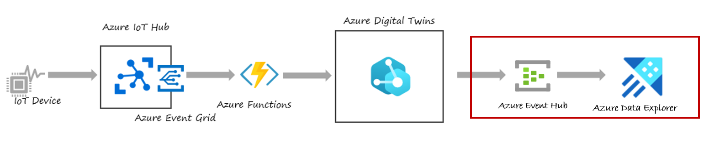
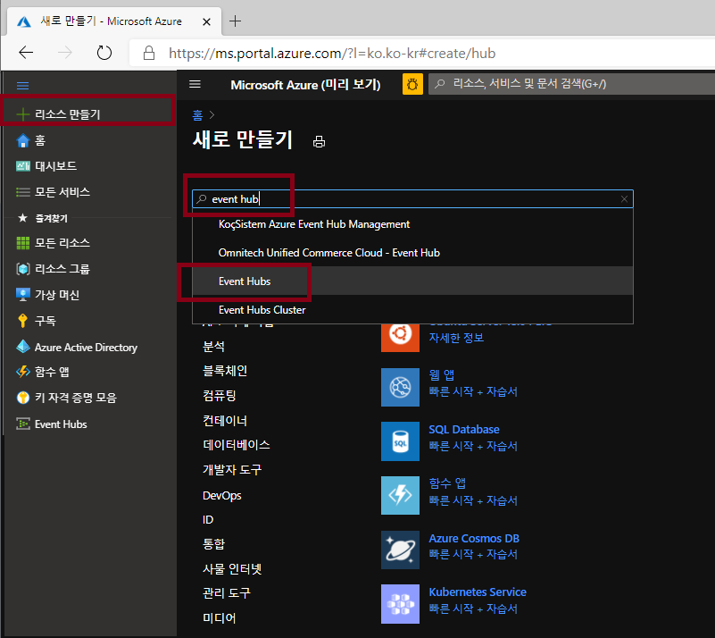
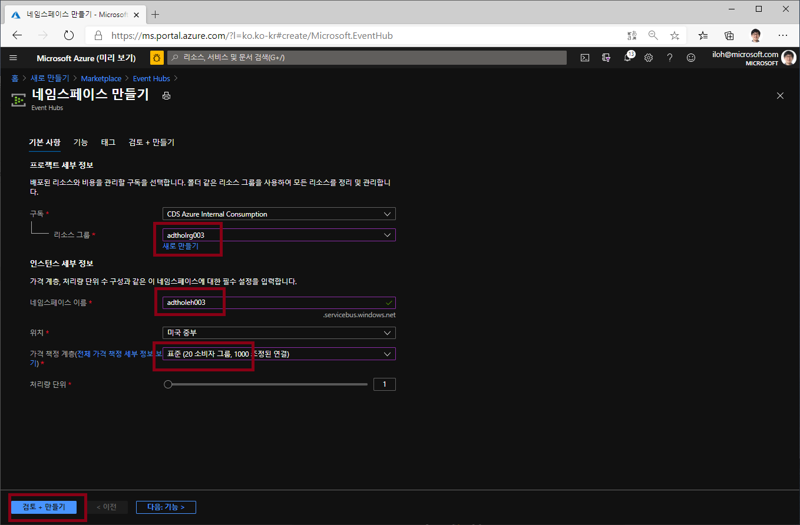
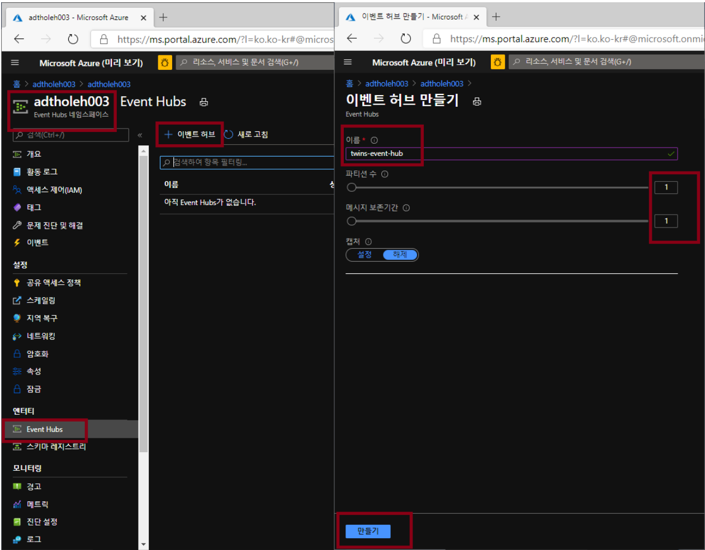
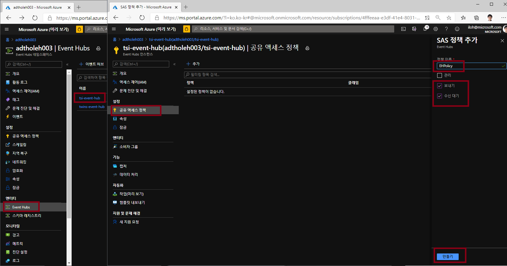
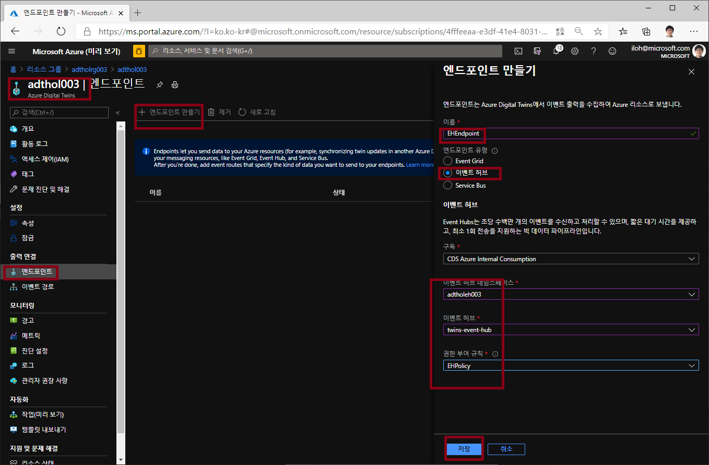
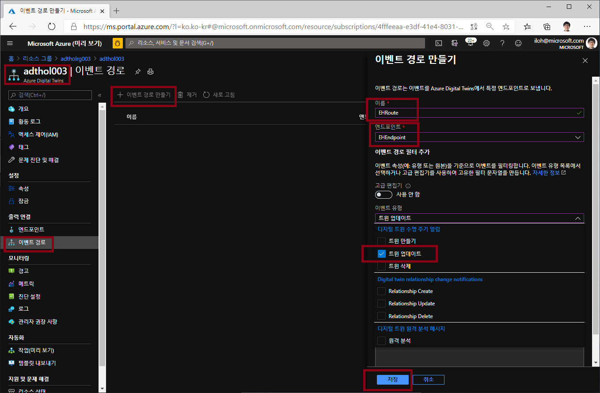

# Lab 5 ADT에서 다른 환경으로 데이터 라우팅 (25분)

ADT는 ADT 라우팅을 통해서 외부 시스템에 ADT의 변경 정보를 보낼 수 있다. 이번 랩에서는 ADT에서 데이터를 이벤트 허브로 보내는 Azure Function을 만들어 보겠습니다. 

## 아키텍쳐 

## 이벤트 허브 만들기 

1. 이벤트 허브 네임스페이스 생성

Azure 포탈의 왼쪽 위 전체 메뉴에서 "리소스만들기"를 선택하고 "event Hub"로 검색하여 이벤트 허브 네임스페이스를 만듭니다. 

 

아래 내용으로 이벤트 허브 네임스페이스를 생성한다. 

 * 구독: 실습에 사용하는 구독 선택
 * 리소스 그룹: 실습에 사용하는 리소스 그룹 선택
 * 네이스페이스 이름: 예)adtholeh003
 * 위치: 미국동부
 * 가격책정계층: 표준

 

### twins-event-hub 이벤트 허브 생성

 Azure 포탈에서 이벤트 허브 네임스페이스로 들어와서 Event Hubs 메뉴를 선택한 후 "+이벤트 허브"를 클릭한다. twins-event-hub 이름으로 이벤트 허브를 만듭니다. 

### twins-event-hub 공유 액세스 정책 만들기

생성한 이벤트 허브에 EHPolicy라는 이름으로 공유 액세스 정책을 만든다. 이 정책에는 보내기, 수신대기 권한을 부여합니다.  

> 주의) 이벤트 허브 네임스페이스에도 공유 액세스 정책이 있습니다. 헷갈릴 수 있는데 이벤트 허브의 공유 엑세스 정책에 만들어야 합니다. 

* 정책이름: EHPolicy
* 보내기, 수신대기 선택

## ADT 라우팅 만들기 

이제 ADT로 가서 위에서 만든 twins-event-hub 이벤트 허브로 연결되는 엔트포인트를 만들고 라우팅을 설정하여 메시지를 외부로 보내는 설정을 합니다. 

### ADT 엔드포인트 생성

* 이름: EHEndpoint
* 엔드포인트 유형: 이벤트 허브
* 이벤트 허브: 구독 / 네임스페이스 / 이벤트허브 (twins-evnet-hub) / 권한부여 규칙(EHPolicy)

### ADT 이벤트 경로 생성

이번에는 ADT에서 발생하는 이벤트 타입중에 "Microsoft.DigitalTwins.Twin.Update" 이벤트를 방금 생성한 엔트포인트로 보내는 설정을 합니다. 

* 이름: EHRoute
* 엔드포인트: EHEndpoint
* 이벤트 유형: 트윈 업데이트

## [Lab 6 Azure Data Explorer로 Visualize](lab6-visualize-tsi.md)

## [실습 홈으로 가기](README.md)
