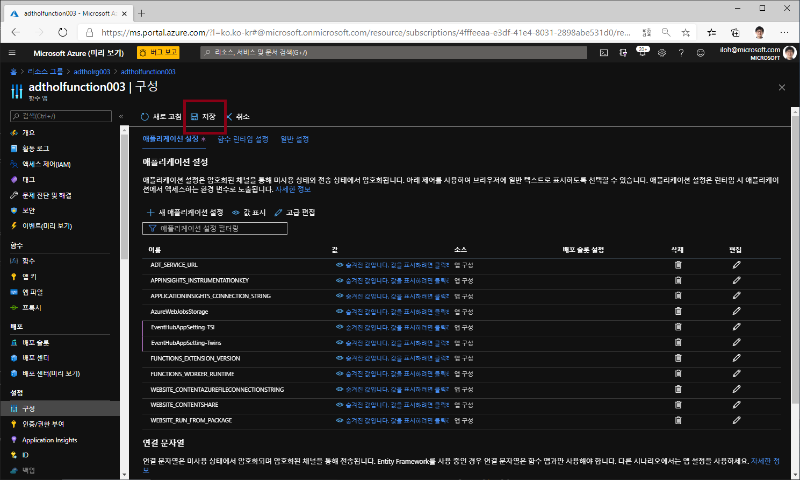
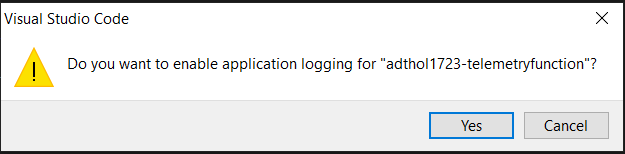
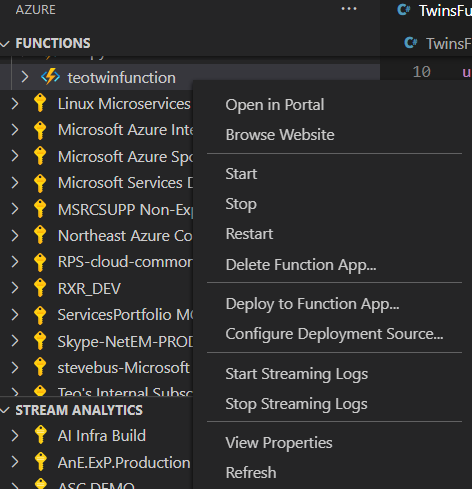

# Lab 5 ADT에서 다른 환경으로 데이터 라우팅 (25분)

ADT는 ADT 라우팅을 통해서 외부 시스템에 ADT의 변경 정보를 보낼 수 있다. 이번 랩에서는 ADT에서 데이터를 이벤트 허브로 보내는 Azure Function을 만들어 보겠습니다. 

## 아키텍쳐 


## 이벤트 허브 만들기 

1. 이벤트 허브 네임스페이스 생성

Azure 포탈의 왼쪽 위 전체 메뉴에서 "리소스만들기"를 선택하고 "event Hub"로 검색하여 이벤트 허브 네임스페이스를 만듭니다. 

 

아래 내용으로 이벤트 허브 네임스페이스를 생성한다. 

 * 구독: 실습에 사용하는 구독 선택
 * 리소스 그룹: 실습에 사용하는 리소스 그룹 선택
 * 네이스페이스 이름: 예)adtholeh003
 * 위치: 미국동부
 * 가격책정계층: 표준

 

### twins-event-hub / tsi-event-hub 이벤트 허브 생성

 Azure 포탈에서 이벤트 허브 네임스페이스로 들어와서 Event Hubs 메뉴를 선택한 후 "+이벤트 허브"를 클릭한다. twins-event-hub / tsi-event-hub 이름으로 2개의 이벤트 허브를 만듭니다. 


### twins-event-hub / tsi-event-hub 공유 액세스 정책 만들기

생성한 이벤트 허브에 각각 EHPolicy라는 이름으로 공유 액세스 정책을 만든다. 이 정책에는 보내기, 수신대기 권한을 부여합니다.  

> 주의) 이벤트 허브 네임스페이스에도 공유 액세스 정책이 있습니다. 헷갈릴 수 있는데 이벤트 허브의 공유 엑세스 정책에 만들어야 합니다. 

* 정책이름: EHPolicy
* 보내기, 수신대기 선택


## ADT 라우팅 만들기 

이제 ADT로 가서 위에서 만든 twins-event-hub 이벤트 허브로 연결되는 엔트포인트를 만들고 라우팅을 설정하여 메시지를 외부로 보내는 설정을 합니다. 

### ADT 엔드포인트 생성

* 이름: EHEndpoint
* 엔드포인트 유형: 이벤트 허브
* 이벤트 허브: 구독 / 네임스페이스 / 이벤트허브 (twins-evnet-hub) / 권한부여 규칙(EHPolicy)


### ADT 이벤트 경로 생성

이번에는 ADT에서 발생하는 이벤트 타입중에 "Microsoft.DigitalTwins.Twin.Update" 이벤트를 방금 생성한 엔트포인트로 보내는 설정을 합니다. 

* 이름: EHRoute
* 엔드포인트: EHEndpoint
* 이벤트 유형: 트윈 업데이트


## Azure Function 만들기 

Lab4에서 사용한 Azure Function App 에 Function 을 하나더 추가해서 ADT에서 나온 이벤트를 Time Series Insight의 포멧으로 변환하여 다음 이벤트 허브로 전달하는 Azure Function을 만듭니다. 

먼저 Function에서 사용할 설정 값을 가져와서 Azure Function의 구성 설정에 업데이트 합니다. 

### ADT 이벤트 허브 Connetion String을 가져와 Azure Function 구성 설정에 넣어줍니다.

* 이름: EventHubAppSetting-Twins
* 값: Endpoint=sb://<eh 이름>.servicebus.windows.net/;SharedAccessKeyName=EHPolicy;SharedAccessKey=eWgNkiIvy/zS3YAfo9eYWBlEzDwFSIBhyFfo0HmLww8=;EntityPath=**twins-event-hub**


### TSI 이벤트 허브 Connection String을 가져와 Azure Function 구성 설정에 넣어줍니다.

* 이름: EventHubAppSetting-TSI 
* 값: Endpoint=sb:// <eh 이름>.servicebus.windows.net/;SharedAccessKeyName=EHPolicy;SharedAccessKey=lBaNIhFgi5YGX2ZsFu1f33YcHGPsGCYOgoJ2WpRTvE=;EntityPath=**tsi-event-hub**


### 반드시 변경내용을 저장하여 적용합니다. 



## Visual Studio Code에서 Azure Function 만들기

Lab 4에서 처럼 Visual Studio Code 에서 Function을 하나더 만들어서 배포합니다. 

1. Visual Studio Code 메뉴에서 View > Command Palette를 선택하거나 Ctrl+Shift+P를 누릅니다. (Mac: Cmd+shift+P) "Azure Function: Create Function..." 을 선택합니다.  


1. 아래 내용으로 설정하여 Function을 만듭니다. 

- **Select a template for your project's first function**: Choose `EventHubTrigger`.
- **Provide a function name**: Type `ProcessDTUpdatetoTSI`.
- **Provide a namespace**: Type `My.Function`.
- **Select setting from local.settings.json**: Hit Enter
- **Select subscription**: Select the subscription you're using
- **Select an event hub namespace**: Choose the eventhub namespace that begins with `adtholfunction003`
- **Select an event hub**: Choose `twins-event-hub`
- **Select an event hub policy**: Choose `EHPolicy`
- **When prompted for a storage account choose**: Skip for now


1. ProcessDTUpdatetoTSI.cs 을 열고 아래 코드를 붙여 넣습니다. 

```C#
using Microsoft.Azure.EventHubs;
using Microsoft.Azure.WebJobs;
using Microsoft.Extensions.Logging;
using Newtonsoft.Json;
using Newtonsoft.Json.Linq;
using System.Threading.Tasks;
using System.Text;
using System.Collections.Generic;

namespace My.Function
{
    public static class ProcessDTUpdatetoTSI
    { 
        [FunctionName("ProcessDTUpdatetoTSI")]
        public static async Task Run(
            [EventHubTrigger("twins-event-hub", Connection = "EventHubAppSetting-Twins")]EventData myEventHubMessage, 
            [EventHub("tsi-event-hub", Connection = "EventHubAppSetting-TSI")]IAsyncCollector<string> outputEvents, 
            ILogger log)
        {
            JObject message = (JObject)JsonConvert.DeserializeObject(Encoding.UTF8.GetString(myEventHubMessage.Body));
            log.LogInformation("Reading event:" + message.ToString());

            // Read values that are replaced or added
            Dictionary<string, object> tsiUpdate = new Dictionary<string, object>();
            foreach (var operation in message["patch"]) {
                if (operation["op"].ToString() == "replace" || operation["op"].ToString() == "add")
                {
                    //Convert from JSON patch path to a flattened property for TSI
                    //Example input: /Front/Temperature
                    //        output: Front.Temperature
                    string path = operation["path"].ToString().Substring(1);                    
                    path = path.Replace("/", ".");                    
                    tsiUpdate.Add(path, operation["value"]);
                }
            }
            //Send an update if updates exist
            if (tsiUpdate.Count>0){
                tsiUpdate.Add("$dtId", myEventHubMessage.Properties["cloudEvents:subject"]);
                await outputEvents.AddAsync(JsonConvert.SerializeObject(tsiUpdate));
            }
        }
    }
}

```

## Azure Function 배포 

1. VSCode function extension에서 **Deploy to Function App...**을 선택합니다. 

    

- **Select subscription**: 실습에 사용중인 구독을 선택합니다. 
- **Select Function App in Azure**: Function 이름을 선택합니다. `adtholfunction003`.

1. 배포가 완료되면 아래 그림과 같이 Start Streaming Logs 창이 뜹니다.
  
1. **Stream Logs** 를 선택하면 다음 단계를 진행한 후에 Azure Function의 로그를 확인 할 수 있습니다. 다음 단계에서 IoT Hub를 설정하고 디바이스에서 메시지를 보내야 로그를 확인 할 수 있습니다. 
1. *enable appication logging*,  Yes를 선택합니다. 
    
1. 다른 방법으로는 VS Code 에서 Azure Function을 찾아 오른쪽 클릭 후 **Start Streaming Logs**를 선택하면 됩니다.
  

여기까지 오면 Azure Digital Twins은 Twin Update 이벤트를 Event Hub(twins-evnet-hub)로 전송하고 Azure Function(ProcessDTUpdatetoTSI)이 처리하여 다시 이벤트허브(tsi-event-hub)로 전송한다. 

## [Lab 6 Time Series Insights로 Visualize](lab6-visualize-tsi.md)

## [실습 홈으로 가기](README.md)