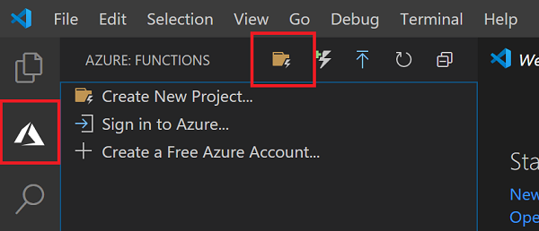

# Lab 5 ADT에서 다른 환경으로 데이터 라우팅


ADT supports sending information about changes to ADT to external systems through ADT routes. In the following section, we'll configure ADT to send data to Event Hubs to be processed by an Azure Function.

## 이벤트 허브 만들기 

1. Create two (2) event hubs.

    ```azurecli
    $ehnamespace = $dtname + "ehnamespace"
    az eventhubs namespace create --name $ehnamespace --resource-group $rgname -l $location
    az eventhubs eventhub create --name "twins-event-hub" --resource-group $rgname --namespace-name $ehnamespace
    az eventhubs eventhub create --name "tsi-event-hub" --resource-group $rgname --namespace-name $ehnamespace
    az eventhubs eventhub authorization-rule create --rights Listen Send --resource-group $rgname --namespace-name $ehnamespace --eventhub-name "twins-event-hub" --name EHPolicy
    az eventhubs eventhub authorization-rule create --rights Listen Send --resource-group $rgname --namespace-name $ehnamespace --eventhub-name "tsi-event-hub" --name EHPolicy
    ```

## ADT 라우팅 만들기 

1. Create an ADT endpoint

    ```azurecli
    az dt endpoint create eventhub --endpoint-name EHEndpoint --eventhub-resource-group $rgname --eventhub-namespace $ehnamespace --eventhub "twins-event-hub" --eventhub-policy EHPolicy -n $dtname
    ```

1. Create an ADT route

    ```azurecli
    az dt route create -n $dtname --endpoint-name EHEndpoint --route-name EHRoute --filter "type = 'Microsoft.DigitalTwins.Twin.Update'"
    ```

## Azure Function 만들기 

1. Create an Azure Function

    ```azurecli
        az functionapp create --resource-group $rgname --consumption-plan-location $location --runtime dotnet --functions-version 3 --name $twinupdatefunctionname --storage-account  $functionstorage
      ```

1. Add application config that stores the connection strings needed by the Azure Function

    ```azurecli
    $adtehconnectionstring=$(az eventhubs eventhub authorization-rule keys list --resource-group $rgname --namespace-name $ehnamespace --eventhub-name twins-event-hub --name EHPolicy --query primaryConnectionString -o tsv)
    $tsiehconnectionstring=$(az eventhubs eventhub authorization-rule keys list --resource-group $rgname --namespace-name $ehnamespace --eventhub-name tsi-event-hub --name EHPolicy --query primaryConnectionString -o tsv)
    az functionapp config appsettings set --settings "EventHubAppSetting-Twins=$adtehconnectionstring" -g $rgname -n $twinupdatefunctionname
    az functionapp config appsettings set --settings "EventHubAppSetting-TSI=$tsiehconnectionstring" -g $rgname -n $twinupdatefunctionname
    ```

## Visual Studio Code에서 Azure Function 만들기

Use Visual Studio Code to create a local Azure Functions project. Later in this article, you'll publish your function code to Azure.

1. Choose the Azure icon in the Activity bar, then in the **Azure: Functions** area, select the **Create new project...** icon.

    

1. Choose a directory location for your project workspace and choose **Select**.

>[!NOTE]
>This directoy should be new, empty, and unique for this Azure Function
>

1. Provide the following information at the prompts:
    - **Select a language for your function project**: Choose `C#`.
    - **Select a template for your project's first function**: Choose `EventHubTrigger`.
    - **Provide a function name**: Type `TSIFunction`.
    - **Provide a namespace**: Type `TSIFunctionsApp`.
    - **Select setting from local.settings.json**: Hit Enter
    - **Select subscription**: Select the subscription you're using
    - **Select an event hub namespace**: Choose the eventhub namespace that begins with `adthol`
    - **Select an event hub**: Choose `twins-event-hub`
    - **Select an event hub policy**: Choose `EHPolicy`
    - **When prompted for a storage account choose**: Skip for now
    - **Select how you would like to open your project**: Choose `Add to workspace`.
1. Open the file TSIFunction.cs
1. Replace the code with the code sample below.

```C#
using Microsoft.Azure.EventHubs;
using Microsoft.Azure.WebJobs;
using Microsoft.Extensions.Logging;
using Newtonsoft.Json;
using Newtonsoft.Json.Linq;
using System.Threading.Tasks;
using System.Text;
using System.Collections.Generic;

namespace TSIFunctionsApp
{
    public static class ProcessDTUpdatetoTSI
    { 
        [FunctionName("ProcessDTUpdatetoTSI")]
        public static async Task Run(
            [EventHubTrigger("twins-event-hub", Connection = "EventHubAppSetting-Twins")]EventData myEventHubMessage, 
            [EventHub("tsi-event-hub", Connection = "EventHubAppSetting-TSI")]IAsyncCollector<string> outputEvents, 
            ILogger log)
        {
            JObject message = (JObject)JsonConvert.DeserializeObject(Encoding.UTF8.GetString(myEventHubMessage.Body));
            log.LogInformation("Reading event:" + message.ToString());

            // Read values that are replaced or added
            Dictionary<string, object> tsiUpdate = new Dictionary<string, object>();
            foreach (var operation in message["patch"]) {
                if (operation["op"].ToString() == "replace" || operation["op"].ToString() == "add")
                {
                    //Convert from JSON patch path to a flattened property for TSI
                    //Example input: /Front/Temperature
                    //        output: Front.Temperature
                    string path = operation["path"].ToString().Substring(1);                    
                    path = path.Replace("/", ".");                    
                    tsiUpdate.Add(path, operation["value"]);
                }
            }
            //Send an update if updates exist
            if (tsiUpdate.Count>0){
                tsiUpdate.Add("$dtId", myEventHubMessage.Properties["cloudEvents:subject"]);
                await outputEvents.AddAsync(JsonConvert.SerializeObject(tsiUpdate));
            }
        }
    }
}

```

## Azure Function 배포 및 Stream Logs 확인

1. In the VSCode function extension, click on on **Deploy to Function App...**
    

    - **Select subscription**: Choose your subscription
    - **Select Function App in Azure**: Choose the function that ends in `twinupdatefunction`.
    - **If prompted to overwrite a previous deployment**: Click `Deploy`
    

1. When the deployment finishes, you'll be prompted to Start Streaming Logs
  
1. Click on **Stream Logs** to see the Twin Update messages received by the Azure Function.

    - Alternatively, you can Stream Logs at a later time by right-clicking on the Azure Function in VS Code and choosing **Start Streaming Logs**
  

At this point, Azure Digital Twins should be sending the Twin Updates it receives to an Event Hub whose events are processed by the Azure Function.  The Azure Function formats the events and published them to another Event Hub where can be ingested by Time Series Insights.