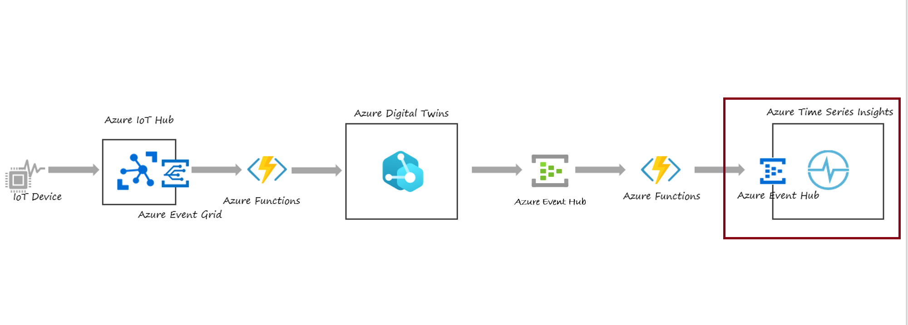
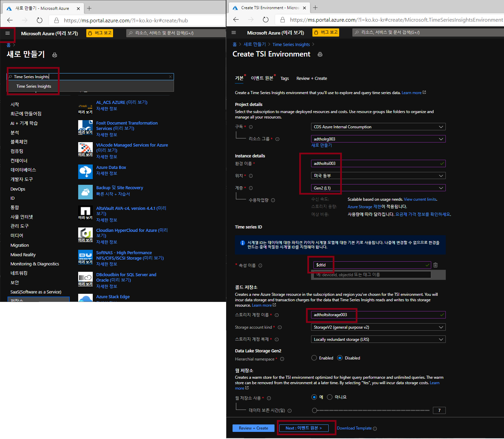
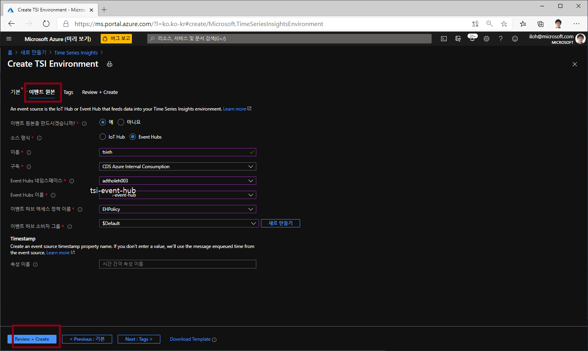
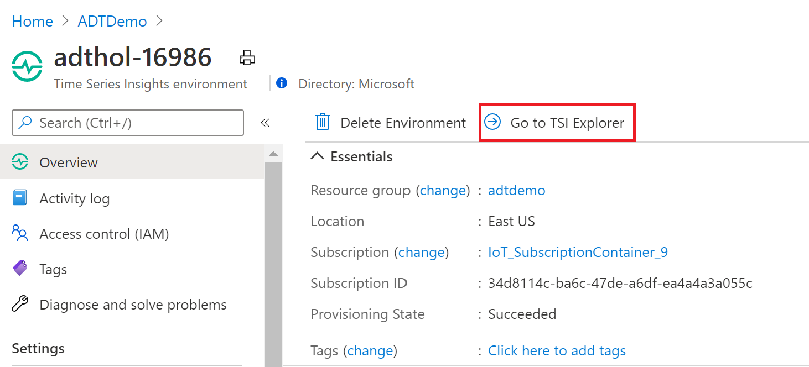
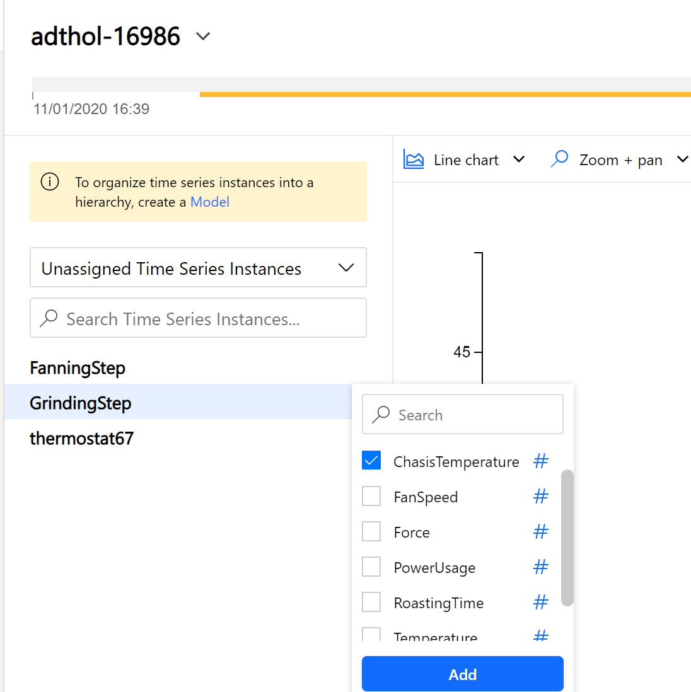
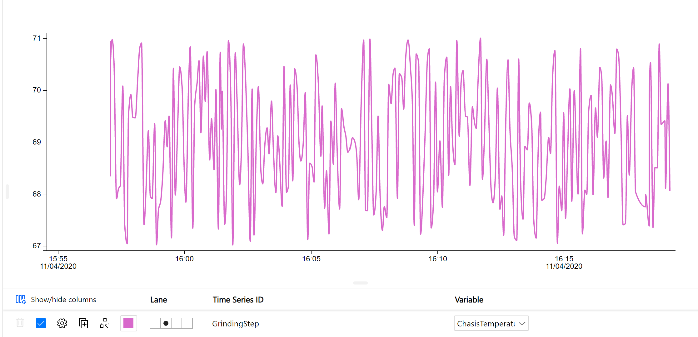

# Lab 6 Time Series Insights로 Visualize (10분)

이제 마지막으로 Azure Digital Twin에서 발생한 데이터를 Time Series Insights(TSI) 에 저장하고 그 내용을 살펴보는 과정입니다. 이렇게 과거 데이터를 TSI에 저장하여 분석할 수 있습니다. 

## 아키텍쳐 

## Time Series Insights(TSI) 만들기 

아래 설정으로 TSI를 생성합니다. 

* 구독: 실습에 사용중인 구독 
* 리소스 그룹: 실습에 사용중인 리소스 그룹
* 위치: 미국동부
* 계층: Get2(L1)
* 속성이름: $dtid
* 스토리지 계정이름: adtholtsistorage003
* Storage kind: StroageV2 / LRS 
* 웜저장소 사용: 예
* 데이터보존시간: 7

 

이벤트 원본 탭에서 이벤트 허브에서 원본을 받도록 설정합니다. 

* 이벤트 원본: 예
* 소스형식: Event Hubs 
* 이름: tsieh 
* 구독: 실습에 사용중인 구독 
* Event Hubs 네임스페이스: 이전에 만든 EH 네임스페이스 선택 (adtholeh003)
* Event Hubs 이름: tsi-event-hub
* 액세스 정책이름: EHPolicy
* 소비자 그룹: $Default 

## TSI 데이터 보기 

이제 데이터가 Time Series Insights로 들어오기 시작해서 분석할 준비가 되었다. 

1. Azure 포탈에서 TSI 인스턴스로 들어갑니다. [Time Series Insights](https://ms.portal.azure.com/#blade/HubsExtension/BrowseResourceBlade/resourceType/Microsoft.TimeSeriesInsights%2Fenvironments) 

1. Go To TSI explorer를 클릭합니다.

  

3. TSI explorer 에서 왼쪽에 ADT의 트윈이 보일 것입니다. GrindingStep을 선택하고 "Chasis Temperature" 선택해보세요. 

    >[!TIP] 데이터가 보이지 않는다면:
    >
    > - 시뮬레이션 디바이스가 작동중이어야 합니다.
    > - Azure Function의 로그에서 오류가 보이지 않아야 합니다. 
    > - 데이터가 표시되려면 약간의 시간이 필요할 수도 있습니다. 
 

## [실습 홈으로 가기](README.md)