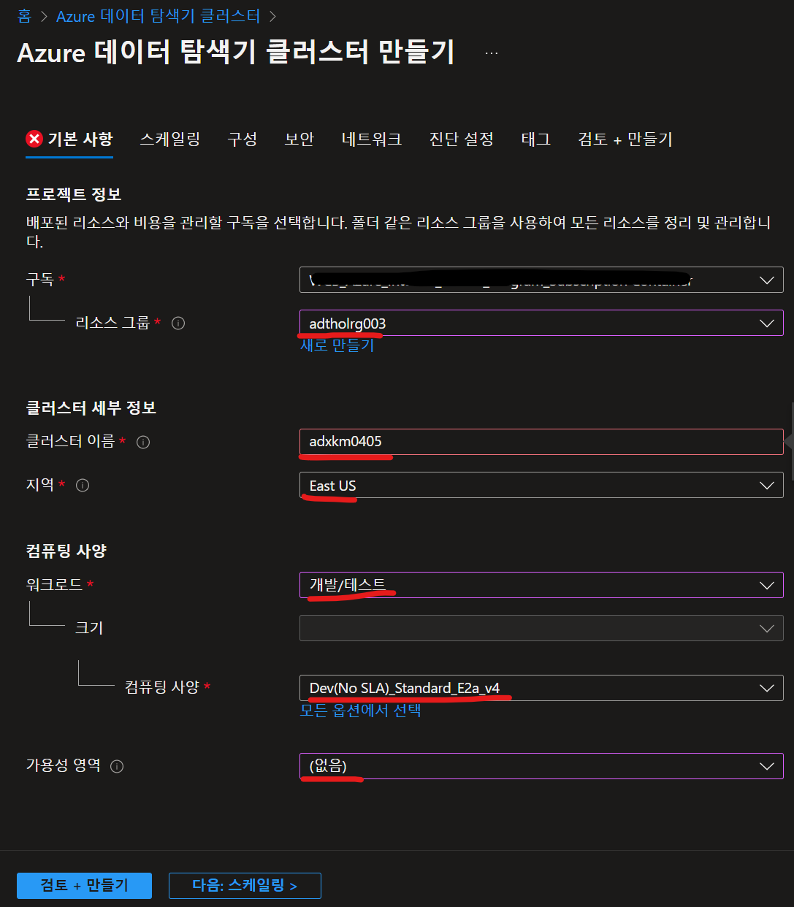
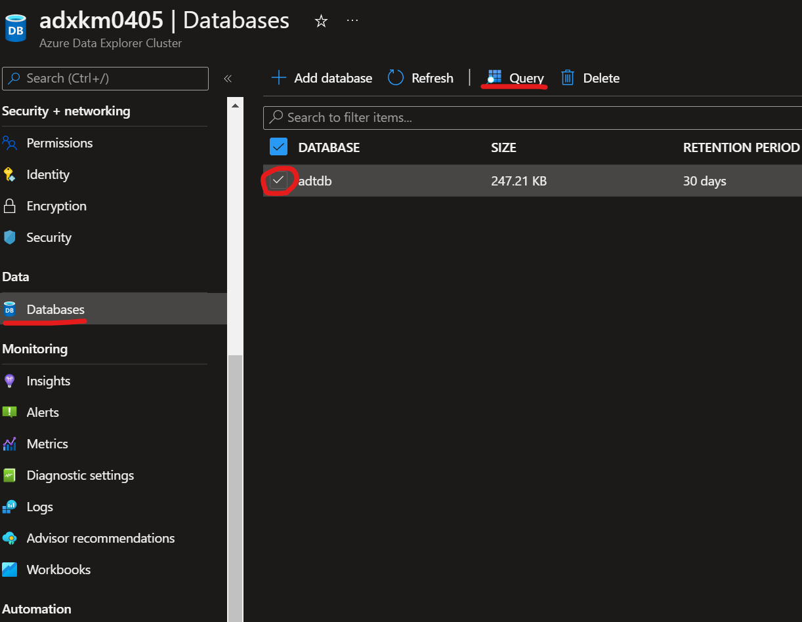

# Lab 6 Azure Data Explorer로 Visualize (10분)

이제 마지막으로 Azure Digital Twin에서 발생한 데이터를 Time Series Insights(TSI) 에 저장하고 그 내용을 살펴보는 과정입니다. 이렇게 과거 데이터를 TSI에 저장하여 분석할 수 있습니다. 

## 아키텍쳐 


## Azure Data Explorer 클러스터 및 데이터베이스 만들기 

Azure Data Explorer를 생성하여 Azure Digital Twins에서 전송하는 데이터를 저장하고 분석 합니다.

Azure Data Explorer를 선택하여 생성합니다.


기본 클러스터 정보를 다음과 같이 입력하여 "검토 + 만들기"를 선택하여 서비스를 생성 합니다.



생성된 Azure Data Explorer 서비스에서 "데이터베이스 추가"를 선택하여 데이터베이스를 생성 합니다.


## Data History 연결 만들기 

Azure Data Explorer를 생성하여 Azure Digital Twins에서 전송하는 데이터를 저장하고 분석 합니다.

실습시 생성하였던 Azure Digital Twins 인스턴스의 "출력 연결" 섹션에서 Data History를 선택 합니다.


보내기 페이지에서 Event Hub 정보를 입력 합니다.


저장소 페이지에서 Azure Data Explorer 정보를 입력 합니다.


사용권한 페이지에서 Event Hubs, Azure Data Explorer 리소스에 연결할 수 있는 Azure Digital Twins 인스턴스 권한을 부여합니다.


검토 + 만들기 페이지에서 리소스의 세부 정보를 검토하고 연결 만들기를 선택합니다.


연결 만들기가 완료되면 Azure Digital Twins 인스턴스의 Data History 페이지로 다시 이동하여 세부 정보를 확인 합니다.


## 샘플 트윈 그래프로 데이터 가시화 

Data History 연결이 완료된 후에 기존에 생성한 트윈 데이터가 Azure Data Explorer에 저장 되어 데이터를 확인 할 수 있습니다.

Azure Digital Twins 데이터 시뮬레이터의 샘플 디지털 트윈 데이터를 사용하여 여러 트윈에 원격 분석을 조절하여 테스트 할 수 있습니다.

샘플 그래프 만들기

브라우저에서 Azure Digital Twins 데이터 시뮬레이터 웹 어플리케이션에 연결 합니다.

* [Azure Digital Twins Data Simulator](https://explorer.digitaltwins.azure.net/tools/data-pusher?eid=adthol-km0406.api.sea.digitaltwins.azure.net&tid=72f988bf-86f1-41af-91ab-2d7cd011db47)

Azure Digital Twins 인스턴스 URL를 입력한 후 "Generate environment" 버튼을 클릭 합니다.


시뮬레이션이 준비되면 "Start simulation"을 선택하여 시뮬레이션된 데이터를 Azure Digital Twins 인스턴스로 푸시합니다.


Event Hubs Namespace 화면에서 Azure Digital Twins에서 들어오는 메시지와 Azure Data Explorer로 보내는 메시지 전송을 차트로 확인 합니다.


Azure Data Explorer 클러스터의 데이터베이스 메뉴로 이동하여 생성된 데이터베이스를 선택하고 Query 메뉴를 선택 합니다.



Azure Data Explorer에 생성된 데이터베이스 하단의 테이블 이름을 선택하고 아래 명령을 복사하여 실행 합니다.
아래 <table-name>을 생성된 테이블 이름으로 변경하여 실행 합니다.
  
```bash
.alter table <table-name> policy ingestionbatching @'{"MaximumBatchingTimeSpan":"00:00:10", "MaximumNumberOfItems": 500, "MaximumRawDataSizeMB": 1024}'
 ```


 다음 쿼리를 실행하여 Azure Data Explorer에 Azure Digital Twins의 데이터가 저장되고 있는지 확인 합니다.

 전체 데이터 수 쿼리
 ```bash
<table_name>
| count
 ```
 
 처음 100개 데이터 쿼리 결과 보기
 ```bash
<table_name>
| limit 100
 ```

 아래 쿼리를 실행하여 Salt machine 두대의 데이터 흐름을 가시화 합니다.
 <ADT-instance> 와 <table_name>을 변경하여 실행합니다.
 
 ```bash
let ADTendpoint = "<ADT-instance>";
let ADTquery = ```SELECT SALT_MACHINE.$dtId as tid
FROM DIGITALTWINS FACTORY 
JOIN SALT_MACHINE RELATED FACTORY.contains 
WHERE FACTORY.$dtId = 'OsloFactory'
AND IS_OF_MODEL(SALT_MACHINE , 'dtmi:assetGen:SaltMachine;1')```;
evaluate azure_digital_twins_query_request(ADTendpoint, ADTquery)
| extend Id = tostring(tid)
| join kind=inner (<table_name>) on Id
| extend val_double = todouble(Value)
| where Key == "OutFlow"
| render timechart with (ycolumns = val_double)
 ```


   


## [실습 홈으로 가기](README.md)
