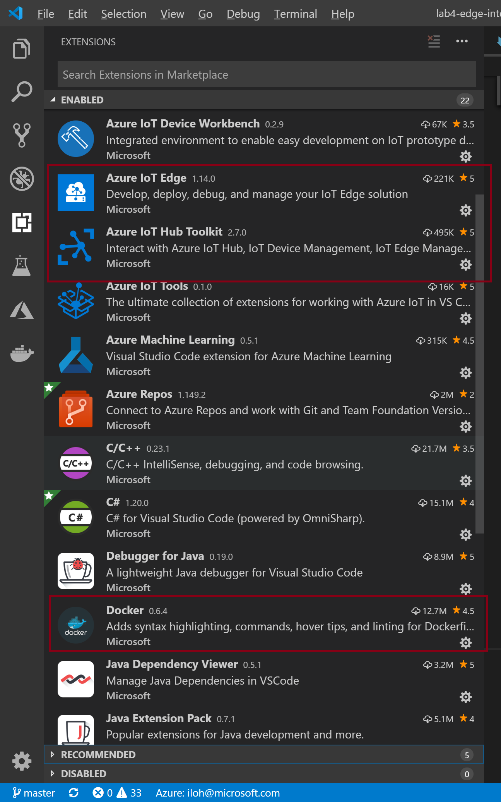

# Azure IoT 기술 실습(Hands On Lab) 자료

## 사전준비 내용

1. Azure 구독 : [체험계정 만들기](https://azure.microsoft.com/ko-kr/free/)

1. 실습용 노트북 준비: Windows 10 PC + 개발환경 설치 
    * [Visual Studio Community 2019 이상 설치](https://www.visualstudio.com/ko/downloads/) 
    * [Azure IoT Explorer 설치](https://github.com/Azure/azure-iot-explorer/releases)
    * [Docker Community Edition설치](https://docs.docker.com/docker-for-windows/install/)
    * [Visual Studio Code 설치](https://code.visualstudio.com/download)
    * Visual Studio Code 확장 설치
      * Azure IoT Edge
      * Azure IoT Hub Toolkit
      * Docker
    * [.NET Core 2.2 설치](https://dotnet.microsoft.com/download/dotnet-core/2.2)

## Lab 2: Azure IoT Edge - Basic

[Ubuntu 18.04 + Azure IoT Edge](lab2-edge-basic-ubuntu.md)

[Raspberry PI + Azure IoT Edge](lab2-edge-basic-rpi.md)

[Windows Server 2019 + Azure IoT Edge Lab](lab2-edge-basic-windows.md)

## Lab 3: Azure IoT Edge - Advanced

[Ubuntu + Azure IoT Edge -Advanced Lab](lab3-edge-advanced-ubuntu.md)

[Raspberry PI + Azure IoT Edge](lab3-edge-advanced-rpi.md)

[Windows Server 2019 + Azure IoT Edge](lab3-edge-advanced-windows.md)

## Lab 4: Azure IoT Edge - Intelligent

[Building Intelligent Edge Device](lab4-edge-intelligent-ubuntu.md)