# Ubuntu 18.04 + Azure IoT Edge (45분)

본 실습에서는 Ubuntu 서버가 IoT Edge 역할을 하면서 디바이스와 센서들을 클라우드에 연결해보는 실습입니다. 이번 실습에서는 Ubuntu 20.04 가상컴퓨터를 만들고 IoT Edge를 설치해서 모듈을 배포해보겠습니다. 특히 Azure 마켓플레이스에 등록된 IoT Edge 모듈을 사용하는 방법도 살펴보겠습니다.

이번 실습을 통해서 

1. Azure IoT Hub 만들기
2. IoT Hub에 Azure IoT Edge 디바이스 생성
3. Azure IoT Edge 설치
4. Azure 마켓플레이스에 있는 모듈 설치하기

## 사전준비

- Azure 구독  

  구독이 없으면 [무료 체험계정 만들기](https://azure.microsoft.com/ko-kr/free/)
  

## Step 0: Ubuntu 가상머신 만들기

실습에서 Edge 디바이스로 사용될 Ubuntu 가상머신을 만듭니다. 

### Step 0-1 : Azure에 로그인

[Azure 포탈](https://portal.azure.com)에 로그인합니다.

### Step 0-2 : 리눅스 가상머신 만들기

가상머신 만들기 문서를 따라서 진행합니다. 

> SSH 공개키에 익숙하지 않으면 암호를 선택하고 아이디와 비밀번호를 입력합니다. 
> 지역은 Korea Central 을 선택할 수 있습니다.

[가상머신 만들기](https://docs.microsoft.com/ko-kr/azure/virtual-machines/linux/quick-create-portal#create-virtual-machine) 내용을 참조하여 Ubuntu 가상머신을 만듭니다.

### Step 0-3 : 가상머신에 SSH 연결

SSH를 활용해서 가상머신에 연결해 봅니다.

[가상머신에 연결](https://docs.microsoft.com/ko-kr/azure/virtual-machines/linux/quick-create-portal#connect-to-virtual-machine)

아이디 비밀번호로 가상머신을 만든 경우

```
ssh azureuser@<ip주소>
Are you sure you want to continue connecting (yes/no/[fingerprint])? yes
<IP주소>'s password:
```

## Step 1 : IoT Hub 만들기

[Azure 포탈](https://portal.azure.com)에서 Azure IoT Hub를 만듭니다. 

### Step 1.1 : [Azure 포탈](https://portal.azure.com)에 로그인

웹브라우저로 [http://portal.azure.com](http://portal.azure.com)에 접속한 후 로그인 합니다. 

### Step 1.2 : Azure IoT Hub 만들기

**Create a resource** -> **Internet of Things** -> **IoT Hub** 를 선택합니다. 

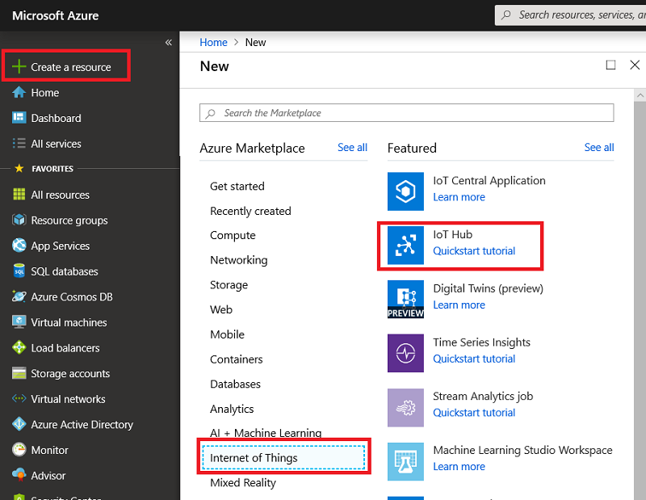

### Step 1.3 : IoT Hub 생성

4가지 파라미터를 입력하여 IoT Hub를 생성합니다. 적절한 이름을 입력해주세요. 

| 파라미터        | 설명                                     | 예                       |
| -------------- | ---------------------------------------- | ------------------------ |
| 구독           | 구독을 선택합니다  | Azure Free Account       |
| 리소스 그룹 | 가상머신을 만들 때 같은 리소스 그룹을 선택  | IoTHOLGroup              |
| 지역           | 가상머신 만들 때 같은 지역을 선택        | Korea Central            |
| IoT Hub 이름   | IoT Hub 이름. URL로 쓰이기 때문에 유일한 이름을 소문자로   | edgehol001        |

1. 4가지 값을 입력하여 IoT Hub를 만듭니다. 
2. IoT Hub 이름은 유일해야 합니다. 녹색 체크박스 확인  
3. **Next: Size and scale>>** 선택

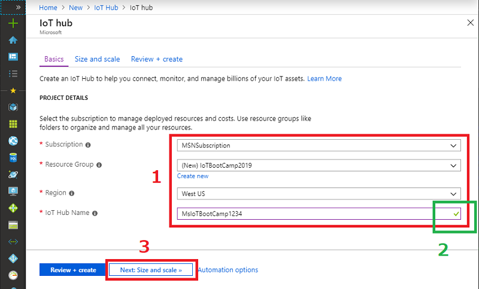

### Step 1.4 : Size and Scale 선택

IoT Hub는 가격과 관련된 Scale과 크기가 있습니다. 각 Scale tier는 서로 다른 한도와 기능제약을 가지고 있습니다. 실제 시나리오에 맡는 크기와 Scale을 선택해야 합니다. Azure IoT Edge를 사용하려면 "무료" 또는 "Standrd" 로 선택해야 합니다. 

여기에서는 무료를 선택하고 `F1: Free tier for Pricing and scale tier` **Review + create** 를 클릭합니다.

> [!NOTE]  
> 무료 IoT Hub는 구독당 하나만 만들수 있습니다. 이미 F1 IoT Hub를 가지고 있다면 Standard 1 (S1)을 선택합니다. 

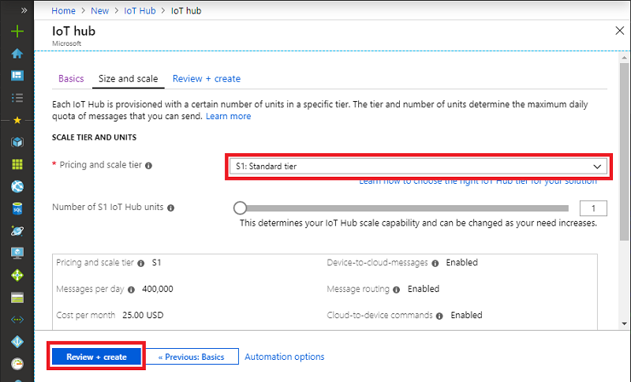

참조 : [솔루션에 대한 올바른 IoT Hub 계층 선택](https://docs.microsoft.com/ko-kr/azure/iot-hub/iot-hub-scaling)

### Step 1.5 : IoT Hub 생성 시작

**Create** 버튼을 눌러 IoT Hub 인스턴스를 생성합니다. 

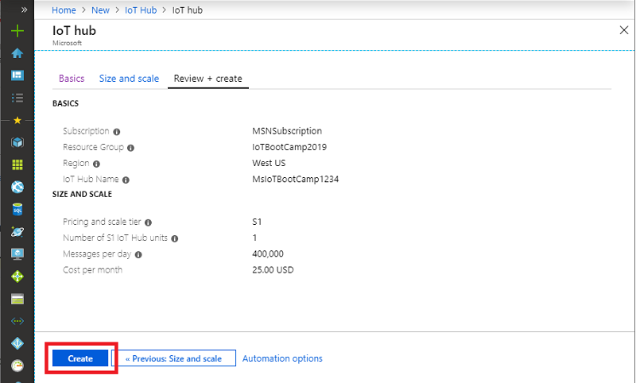

### Step 1.6 : 배포가 완료될 때까지 대기

배포가 완료될 때까지 기다립니다. 

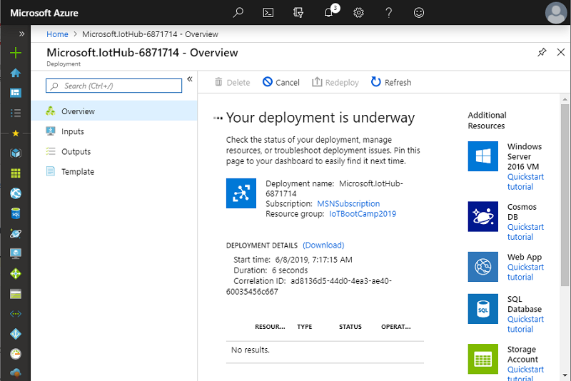

> [!TIP]  
> `Notifications` 알림창을 통해서도 배포 진행상황을 확인 할 수 있습니다. 
>  
> 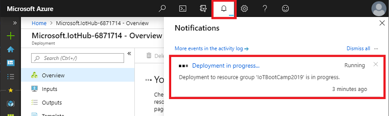


## Step 2 : 새로운 Azure IoT Edge 디바이스 등록

Azure IoT Hub에 Azure IOT Edge Device를 등록합니다. 

### Step 2.1 : 생성한 IoT Hub에 들어갑니다. 

`Go to resource` 버튼을 눌러 IoT Hub에 들어갑니다. 또는 Azure Portal 에서 새로만든 Azure IoT Hub를 찾아 들어갑니다.

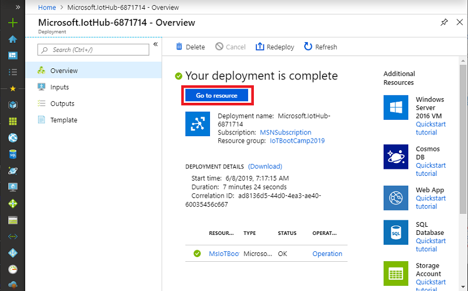

### Step 2.2 : IoT Edge 메뉴

IoT Edge 메뉴를 선택합니다

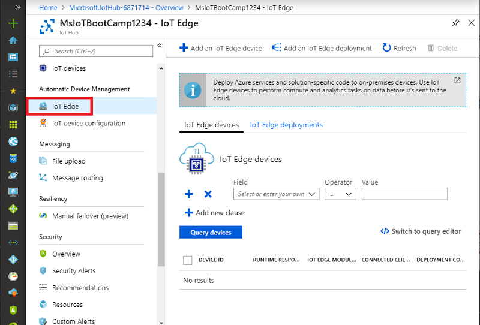

### Step 2.3 : IoT Edge 디바이스 추가

새로운 IoT Edge 디바이스를 추가합니다. 

Click **Add an IoT Edge device**  

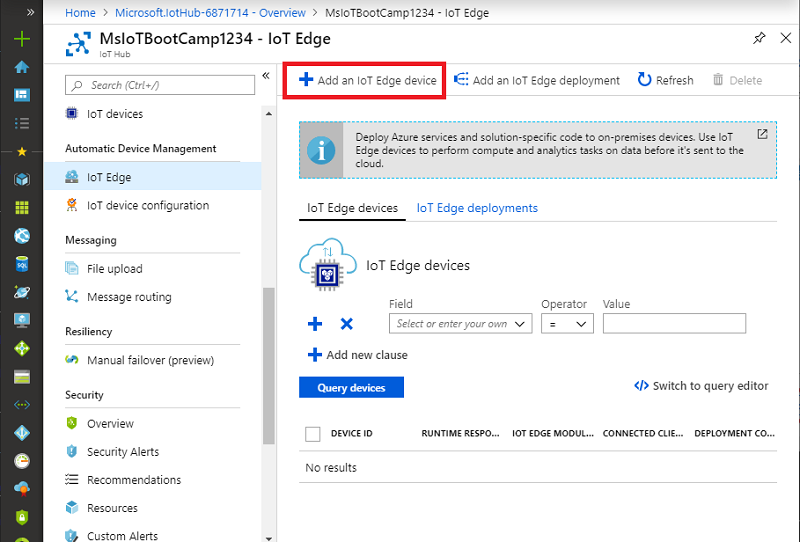

### Step 2.4 : Device ID

디바이스 아이디는 IoT Edge 디바이스를 구분하는 ID로 사용됩니다. 

1. 유일한 이름을 사용합니다.   
  e.g. IoTHOLWindows2019-1

1. **Save** 클릭

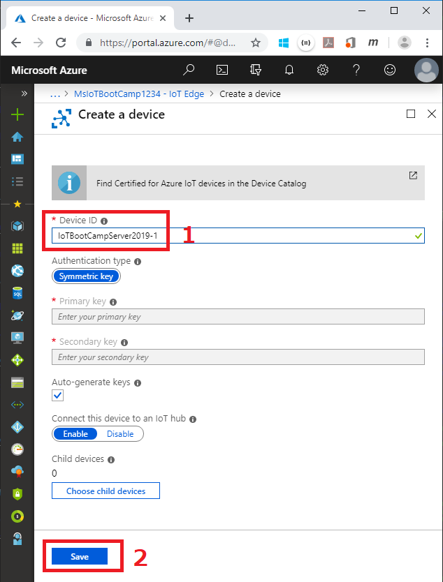

### Step 2.5 : 새로운 IoT Edge 디바이스 확인

새로운 IoT Edge 디바이스를 **Refresh** 버튼을 눌러 확인합니다. 

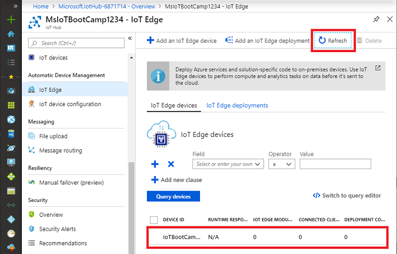

## Step 3 : Connection string

IoT Edge 디바이스를 IoT Hub에 연결하려면 **Connection String**이 필요합니다. 디바이스 Connection String은 IoT Hub가 디바이스를 인증하는데 사용됩니다. 

> 실습에서는 연결문자열(Connection String)을 사용하지만 실제 배포에서는 IoT Hub Device Provisioning Service 를 사용하는 것이 좋습니다. 

> 연결문자열은 두가지 종류가 있습니다. 디바이스의 연결 문자열은 Edge 디바이스에서 사용됩니다. 다른 하나는 클라우드의 서비스 구현에 사용하는 연결 문자열이 있습니다. 헷갈릴 수 있습니다. ([참조](https://devblogs.microsoft.com/iotdev/understand-different-connection-strings-in-azure-iot-hub/))

### Step 3.1 : 디바이스 상세 보기

**IoT Edge** 메뉴에서 디바이스 이름을 클릭하면 **Device Details** 페이지를 통해 IoT Edge 디바이스의 상세 정보를 볼 수 있습니다.

> [!TIP]  
> 각 디바이스마다 두개의 Connection String을 제공합니다. 

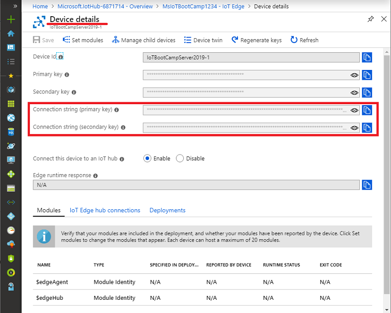

### Step 3.2 : Connection String 복사

Connection String 두개 중에 하나를 복사해 둡니다. 

1. **Copy button**  을 누르면 클립보드에 복사됩니다.
  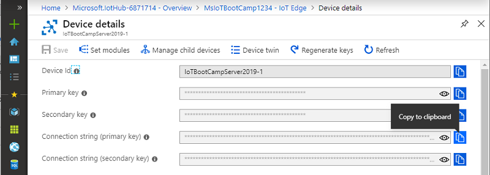
1. 텍스트 파일에 복사해 둡니다.

## Step 4 : Ubuntu 가상머신에 연결하기

> [!IMPORTANT]  
> Step 0에서  가상머신 만들때 ID/비밀번호를 알고 있어야 합니다. 

Ubunt 가상머신에 Azure IoT Edge 설치 및 구성을 위해서 SSH 연결합니다. 

### Step 4.1 : SSH 접속

1. Step 0에서 만든 가상머신 속성 페이지에서 **Connect** 버튼을 SSH 접속 정보를 가져와서 Putty 등을 이용해서 접속합니다. 

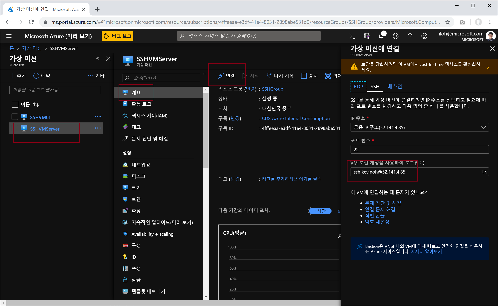

맥이나 리눅스는 터미널을 열고 윈도우는 파워쉘을 열어서 SSH로 가상머신에 접속합니다. 

```
ssh azureuser@<ip주소>
Are you sure you want to continue connecting (yes/no/[fingerprint])? yes
<IP주소>'s password:
```

## Step 5 : Ubuntu에 Azure IoT Edge 런타임 설치하기

이번엔 Ubuntu 가상머신에 Azure IoT Edge 런타임을 설치해보겠습니다. [대칭 키를 사용하여 Linux에서 IoT Edge 디바이스 만들기 및 프로비전](https://docs.microsoft.com/ko-kr/azure/iot-edge/how-to-provision-single-device-linux-symmetric?view=iotedge-2020-11&tabs=azure-portal%2Cubuntu#install-iot-edge) 문서를 따라서 진행합니다. 

> IoT Edge 1.2 버전으로 진행합니다.

### Step 5.1 : 패키지 리포지토리를 추가한 다음, 신뢰할 수 있는 키 목록에 Microsoft 패키지 서명 키를 추가
```bash
wget https://packages.microsoft.com/config/ubuntu/18.04/multiarch/packages-microsoft-prod.deb -O packages-microsoft-prod.deb
sudo dpkg -i packages-microsoft-prod.deb
rm packages-microsoft-prod.deb
```

### Step 5.2 : 컨테이너 엔진 설치

```bash
sudo apt-get update; \
  sudo apt-get install moby-engine
```

### Step 5.3 : 로깅 드라이버를 local로 설정

/etc/docker/deamon.json 파일을 생성하고 

```bash
sudo nano /etc/docker/deamon.json
```

아래 예제와 같이 기본 로깅 드라이버를 local로 설정한 후 저장합니다. 

```json
{
  "log-driver": "local"
}
```

> 파일 편집기는 손에 익은 걸 사용합니다. 

docker를 재시작 합니다. 

```bash
sudo systemctl start docker
```

### Step 5.4 : IoT Edge 런타임 설치

```bash
sudo apt-get update; \
  sudo apt-get install aziot-edge defender-iot-micro-agent-edge
```

여기까지 컨테이너 엔진과 IoT Edge 런타임이 디바이스에 설치되었습니다.

### Step 5.5 : Edge 디바이스 프로비저

우리가 작업하고 있는 가상머신이 Edge 디바이스 입니다. 이 Edge 디바이스를 IoT Hub에 연결하기 위한 설정을 합니다. 이전 단계에서 생성한 연결문자열을 사용합니다. 

iotedge config mp 명령은 디바이스에 구성 파일을 만들고 파일에 연결 문자열을 입력합니다.

```bash
sudo iotedge config mp --connection-string '연결문자열'
```
구성 변경 내용을 적용합니다.

```bash
sudo iotedge config apply
```
구성파일을 열어서 확인해봅니다. 

```bash
sudo nano /etc/aziot/config.toml
```

### Step 5.6 : 설치 및 구성 확인

Azure IoT Edge 버전확인

```bash
$ sudo iotedge version
iotedge 1.2.10
```

Azure IoT Edge 상태 확인 

```bash
$ sudo iotedge system status
System services:
    aziot-edged             Running
    aziot-identityd         Running
    aziot-keyd              Running
    aziot-certd             Running
    aziot-tpmd              Ready

Use 'iotedge system logs' to check for non-fatal errors.
Use 'iotedge check' to diagnose connectivity and configuration issues.
```

로그 확인 방법
```bash
sudo iotedge system logs
```

디바이스 구성 및 연결상태 확인 
production readiness 등의 오류가 보이지만 실습에서는 넘어갑니다. 

```bash
sudo iotedge check
```

현재 설치된 모듈 확인 

초기 설치된 상태에서는 edgeAgent만 설치됩니다.

```bash
sudo iotedge list
```

기타 iotedge 명령어로 할 수 있는 것들

```bash
sudo iotedge
iotedge 1.2.10
The iotedge tool is used to manage the IoT Edge runtime.

USAGE:
    iotedge [OPTIONS] <SUBCOMMAND>

FLAGS:
    -h, --help       Prints help information
    -V, --version    Prints version information

OPTIONS:
    -H, --host <HOST>    Daemon socket to connect to [env: IOTEDGE_HOST=]  [default: unix:///var/run/iotedge/mgmt.sock]

SUBCOMMANDS:
    check             Check for common config and deployment issues
    check-list        List the checks that are run for 'iotedge check'
    config            Manage Azure IoT Edge system configuration.
    help              Prints this message or the help of the given subcommand(s)
    list              List modules
    logs              Fetch the logs of a module
    restart           Restart a module
    support-bundle    Bundles troubleshooting information
    system            Manage system services for IoT Edge.
    version           Show the version information
```

## Step 6 : 'Simulated Temperature Sensor'를 마켓플레이스에서 Ubuntu Server로 배포하기

Azure 마켓플레이스에는 마이크로소프트가 검증해 놓은 엔터프라이즈 환경에서 사용할 수 있는 다양한 Azure의 애플리케이션과 서비스가 있는 온라인 마켓입니다.  여기에는 미리 많들어 놓은 여러가지 [IoT Edge 모듈](https://aka.ms/iot-edge-marketplace)을 찾아볼 수 있습니다. 이중에서 온도센서 시뮬레이터를 사용해 보겠습니다. 

### Step 6.1 :  Azure IoT Edge 마켓플레이스 열기

Azure 포탈에서도 마켓플레이스를 제공합니다. 

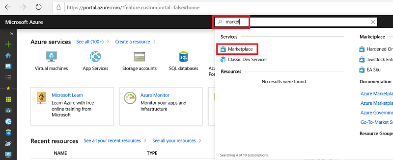

### Step 6.2 : **Simulated Temperature Sensor** 검색

마켓플레이스에서 *simulated* 를 입력하여 검색한 후 **Simulated Temperature Sensor**를 클릭 합니다. 

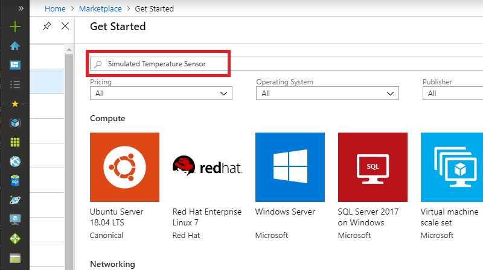

### Step 6.3 : Simulated Temperature Sensor 모듈 생성

**Create**를 클릭합니다.

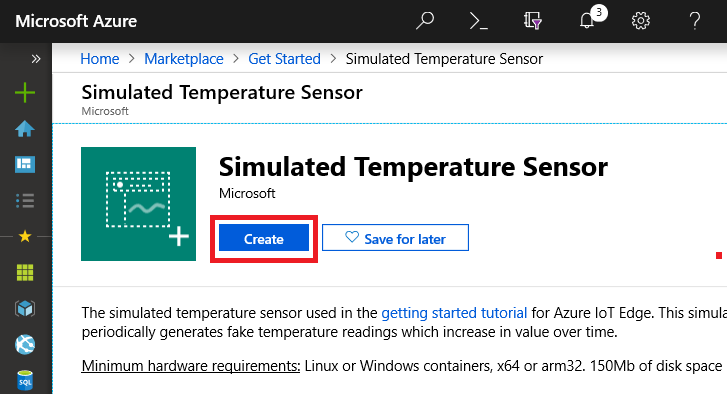

### Step 6.4 : IoT Edge 디바이스를 선택

이 단계에서는 어떤 디바이스에 모듈을 배포할지 선택합니다. 이전에 만든 IoT Edge 디바이스를 선택합니다. 찾기 (Find devcie) 버튼을 눌러 찾을 수 있습니다. 

| Parameter            | Description                                                                                                    | Example                 |
| -------------------- | -------------------------------------------------------------------------------------------------------------- | ----------------------- |
| 구독         | 내 구독 선택                                                                                       | Azure Free Account         |
| IoT Hub              | 내 IoTe Hub 선택 | IoTHOLHub       |
| IoT Edge Device 이름 | 이전 단계에서 만든 IoT Edge 디바이스 | EdgeHOL004

 **Create** 를 클릭하여 다음 단계로 넘어갑니다. 

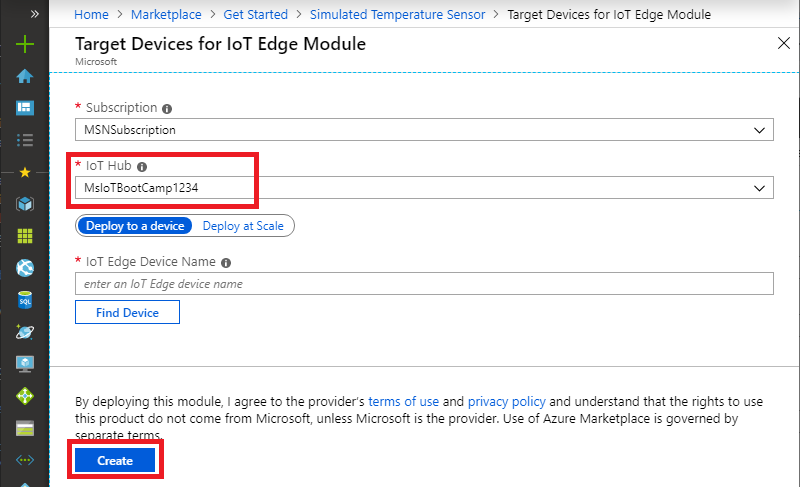

### Step 6.5 : 모듈 추가

**Next** 을 클릭하여 넘어갑니다.

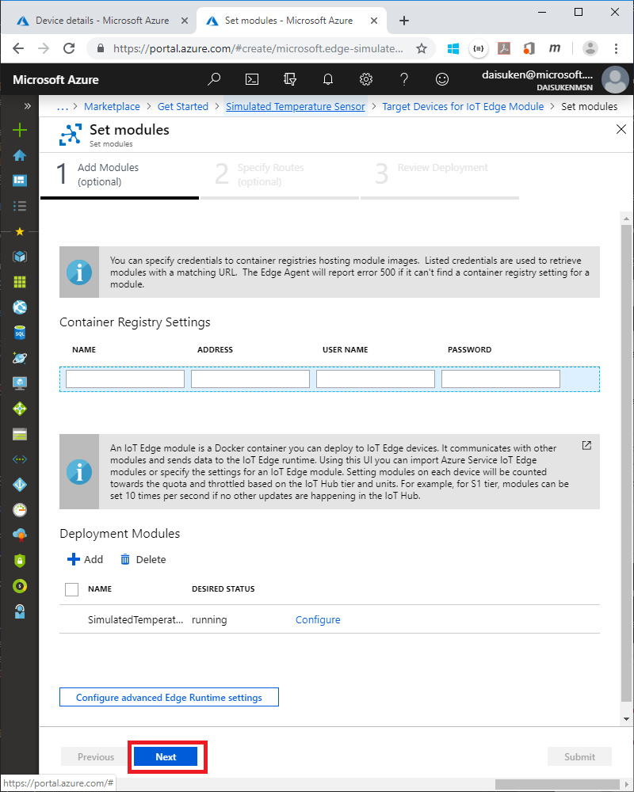

### Step 6.6 : 라우팅 설정

IoT Edge 모듈에서 나가고 들어오는 메시지에 대한 라우팅 설정을 해줄 수 있습니다. 여기에서는 모든 메시지를 Azure IoT Hub($upstream)로 보내도록 설정합니다.

**Next** 을 클릭하여 넘어갑니다.

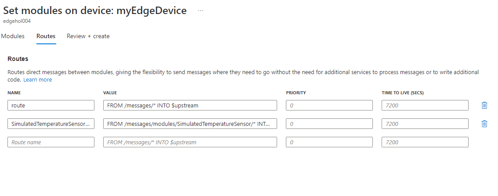

 **Next** 을 클릭하여 넘어갑니다.

Reference : [https://docs.microsoft.com/en-us/azure/iot-edge/module-composition#declare-routes](https://docs.microsoft.com/en-us/azure/iot-edge/module-composition#declare-routes)

### Step 6.7 : 배포를 전송

**Create** 버튼을 눌러 temperature simulator를 IoT Edge 디바이스(이전 단계에서 만든 가상머신)에 배포합니다. 아래 스크릿샷에서 보이는 Json 데이터가 Deployment Manifest 입니다. 

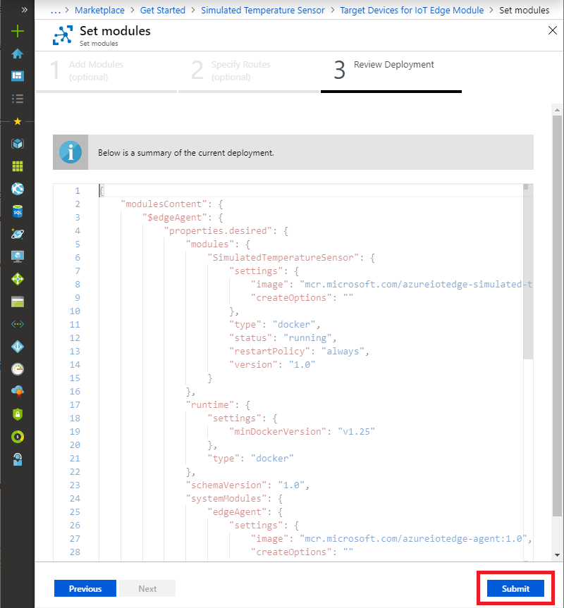

## Step 7 : Temperature Simulator 모듈 배포 확인

 simulated temperature sensor 모듈은 테스트를 위한 온도데이터를 생성합니다. 이런 센서는 서버실, 공장, 풍력발전기 등에 설치 되어 온도, 습도, 압력 등의 값을 발생 시킵니다. 

### Step 7.1 : 모듈 배포 및 작동 확인 

모듈이 클라우드로 부터 IoT Hub를 통해 디바이스까지 배포가 되었는지 확인 합니다. 

```powershell
$ iotedge list
NAME                        STATUS           DESCRIPTION      CONFIG
SimulatedTemperatureSensor  running          Up 40 seconds    mcr.microsoft.com/azureiotedge-simulated-temperature-sensor:1.0
edgeAgent                   running          Up a minute      mcr.microsoft.com/azureiotedge-agent:1.1
edgeHub                     running          Up 33 seconds    mcr.microsoft.com/azureiotedge-hub:1.1
```


### Step 7.2 : 메시지 전송 확인

온도센서에서 클라우드로 보내는 메시지를 모듈 로그를 통해서 확인합니다. 

```powershell
$ iotedge logs SimulatedTemperatureSensor -f
[2022-06-23 01:43:26 : Starting Module
SimulatedTemperatureSensor Main() started.
Initializing simulated temperature sensor to send 500 messages, at an interval of 5 seconds.
To change this, set the environment variable MessageCount to the number of messages that should be sent (set it to -1 to send unlimited messages).
[Information]: Trying to initialize module client using transport type [Amqp_Tcp_Only].
[Information]: Successfully initialized module client of transport type [Amqp_Tcp_Only].
        06/23/2022 01:43:42> Sending message: 1, Body: [{"machine":{"temperature":21.817355309644412,"pressure":1.093116427681009},"ambient":{"temperature":21.404926300935877,"humidity":26},"timeCreated":"2022-06-23T01:43:42.9359902Z"}]
        06/23/2022 01:43:48> Sending message: 2, Body: [{"machine":{"temperature":22.57772301373897,"pressure":1.179740596501908},"ambient":{"temperature":20.622843755000662,"humidity":25},"timeCreated":"2022-06-23T01:43:48.120036Z"}]
```

### Step 7.3 : IoT Hub에서 메시지 수신 확인 

개발 단계에서 Azure IoT Hub에 직접 연결하여 메시지를 확인 하거나 IoT Hub의 디바이스를 직접 제어할 수 있는 도구가 제공됩니다. [Azure IoT Explorer](https://github.com/Azure/azure-iot-explorer/releases) 입니다. 

[릴리즈 페이지](https://github.com/Azure/azure-iot-explorer/releases)에서 최신 버전을 다운로드 받아 설치합니다. 개발환경이 윈도우라면 msi 파일을 받아서 설치합니다. 

IoT Hub에 접근하기 위해서는 다시 **Connection String**이 필요합니다. 이번에는 IoT Hub Connection String입니다. Device Connection String과 헷갈리면 안됩니다.

1. Device Explorer 실행
    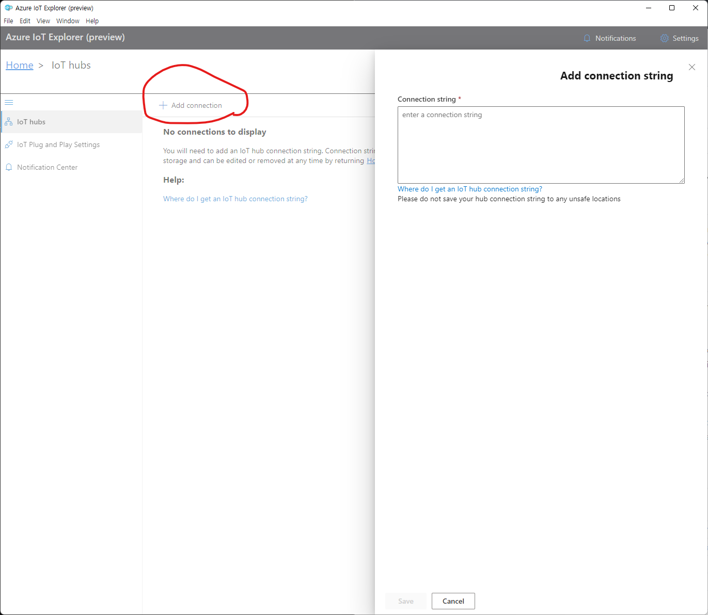

1. **Shared Access Policies**  
    Azure Portal의 IoT Hub로 가서 Shared Access Policies 메뉴를 클릭합니다.  

1. **iothubowner** 클릭
    iothubowner를 클릭합니다. 
    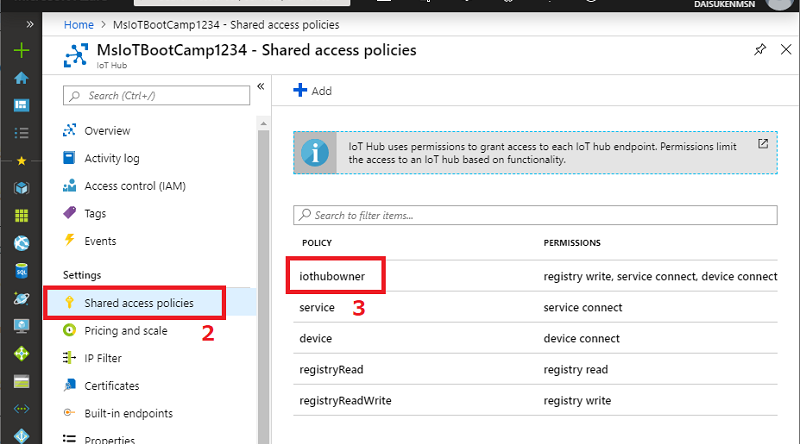

1. Connection String 복사
    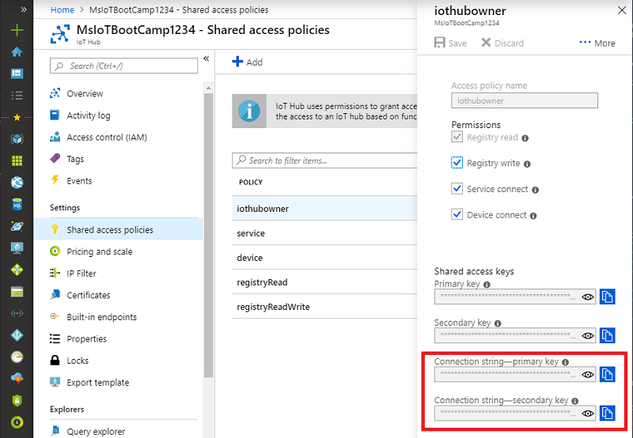

1. Device Explorer에 Connection String를 복사하여 입력
1. **Update** 클릭
    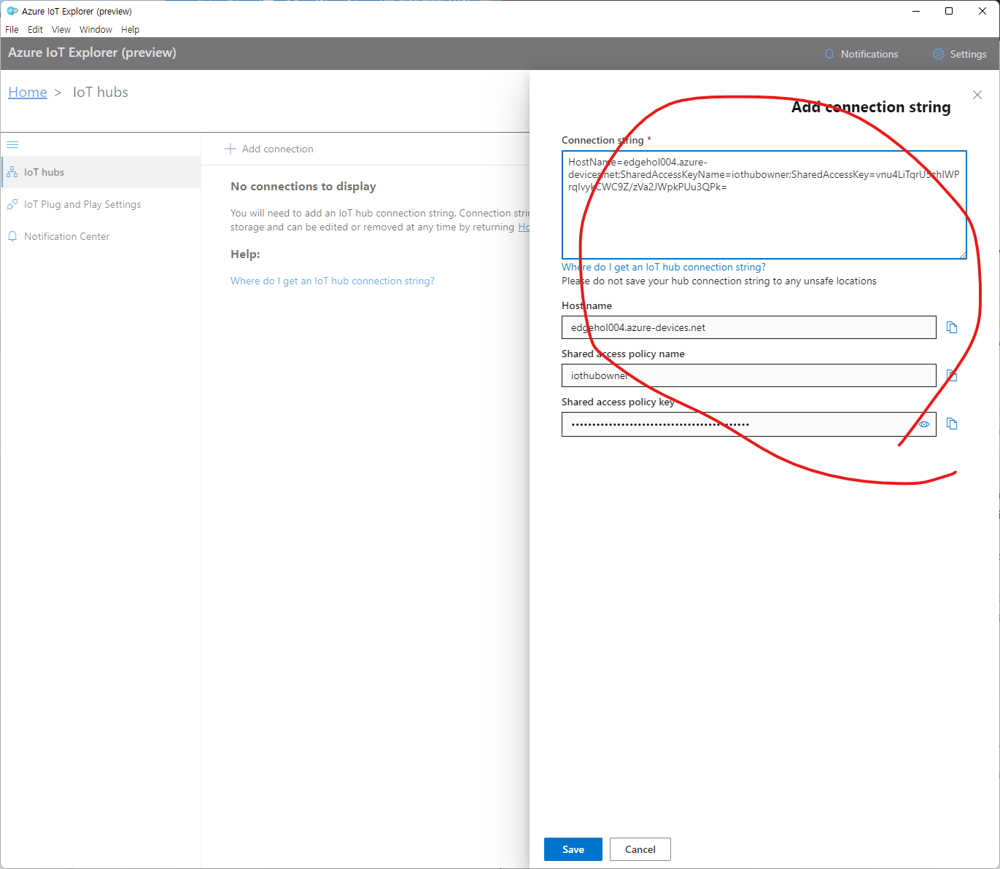

1. **Telemetry** 탭 선택
1. 이제 우리가 작업중인 Azure IoT Edge 디바이스가 보입니다. 클릭해서 들어가면 Telemetry 메뉴가 있습니다. **Start**를 클릭합니다. 

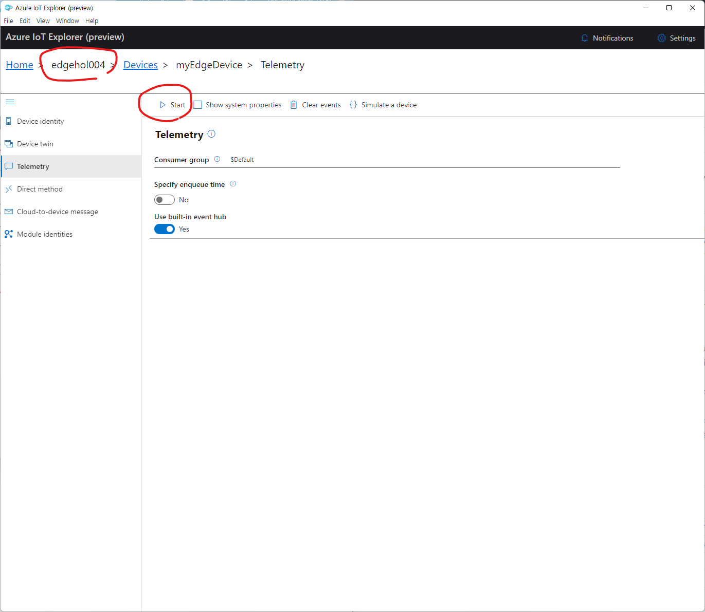

1. **Monitor** 클릭
메시지 수식 확인
    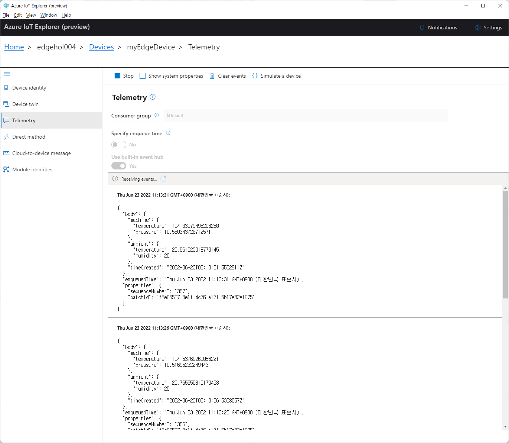
