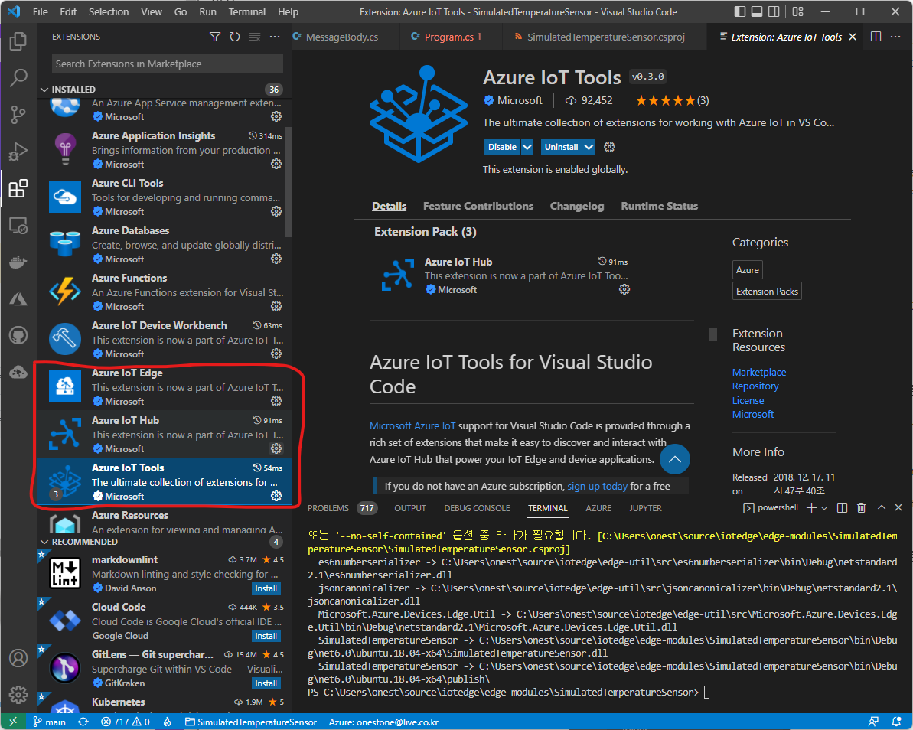

# Ubuntu + Azure IoT Edge - Advance Lab (60분)

Visual Studio Code (VSCode)는 개발자의 개발 속도를 향상시키는 파워풀한 크로스플랫폼 무료 개발환경입니다. 이번 실습에서는 IoT Edge의 개발 프로세스를 알아보면서 VSCode를 사용하여 IoT Edge 모듈을 배포해보겠습니다. 

이번 실습을 통해서 

- VSCode에서 IoT Edge 디바이스 생성
- Ubuntu 에 Azure IoT Edge 런타임 설치 
- Azure Container Registry (ACR) 만들기
- Azure IoT Edge Module의 다운로드와 빌드

## 사전준비

- [Visual Studio Code 설치](https://code.visualstudio.com/download)
- Visual Studio 용 Azure IoT Hub Toolkit, Azure IoT Edge

- Lab 2에서 만든 Azure IoT Hub
- .Net Core 설치
    [Download .NET 6.0](https://dotnet.microsoft.com/en-us/download/dotnet/6.0)

## Step 0 : VS Code 설정

본 실습에서는 VS Code를 사용하겠습니다. 2가지 확장(Extension)을 설치합니다. 

1. Azure IoT Hub TooKit
1. Azure IoT Edge



확장설치가 끝나면 메뉴에서 "보기 > 명령 팔레트" 를 선택하거나 Ctrl + Shift + P 를 누릅니다. 

명령 팔레트에서 "Azure: 로그인" 명령을 검색하여 실행합니다. 표시되는 메시지에 따라 Azure 계정에 로그인합니다.


다시 명령 팔레트에서 "Azure: IoT Hub" 선택을 선택합니다. 지시에 따라 Azure 구독 및 IoT Hub를 선택합니다.


왼쪽의 작업 표시줄에서 아이콘을 선택하거나 보기>탐색기를 선택하여 Visual Studio Code의 탐색기 섹션을 엽니다.

탐색기 섹션 맨 아래에서 축소된 Azure IoT Hub/디바이스 메뉴를 확장합니다. 명령 팔레트를 통해 선택한 IoT Hub와 연결된 디바이스 및 IoT Edge 디바이스가 표시됩니다.


## Step 1 : Azure Container Registry (ACR) 만들기

우리가 만든 Azure IoT Edge 모듈을   배포하기 위해서는 이미지를 컨테이너 레지스트리에 푸시 해야 합니다. 일단 이미지가 레지스트리에 올라가면 직접 IoT Edge 디바이스에 배포할 수 있습니다. Azure 에서는 Private 컨테이너 레지스트리인 Azure Container Registry(ACR)를 제공하는데 ACR을 만들어보겠습니다. 

### Step 5.1 : Azure Container Registry 만들기

1. [Azure Portal](https://portal.azure.com/)에 로그인 합니다. 

1. **Container Registry** 를 검색하여 만들기를 클릭합니다. 
    **Create a resource** -> **Containers** -> **Container Registry**

    

### Step 5.2 : ACR 생성 파라미터를 입력

리소스그룹이름과 레지스트리 이름을 입력합니다.  


|Parameter  |Description  |Example  |
|---------|---------|---------|
|Registry Name     |  URL로 사용 유일해야 함(5-50 alphanumeric characters only) | IoTHOL2019acr1         |
|구독     | 내구독 선택         |         |
|리소스그룹     | 현재 작업중인 리소스 그룹         | IoTHOL2019         |
|지역     | Korea Central         | Korea Central         |
|SKU     | 기본기능만 있는 Basic         | Basic        |

### Step 5.3 : ACR 배포를 시작

**Create** 를 클릭하여 배포를 시작합니다. 

생성이 되면 생성된 ACR 의 "Access Key"메뉴로 들어가서 "Admin User"를 Enable 시킵니다. 그러면 비밀번호가 생성되고 docker login 으로 연결할 수 있습니다. 


### Step 5.4 : ACR에 로그인

후반부에 우리가 만든 컨테이너 이미지를 푸시 하기 위해서는 ACR에 로그인을 해야 합니다. 

> 개발하는 환경에 docker desktop (윈도우의 경우) 이 실행되어야 합니다. 

1. VSCode open Terminal  

    터미널 윈도우가 없다면 메뉴에서 **Terminal** -> **New Terminal**를 선택합니다.

    

1. ACR Access Key  
    포탈에서 ACR의 `Access Key`를 복사합니다. 

    

1. ACR에 아래 명령으로 로그인

```bash
docker login <Your ACR Login Server Name> -u <Your ACR user name> -p <Your ACR password>
```
  
예시 :

```bash
docker login edgeholacr004.azurecr.io -u edgeholacr004 -p ysWlA=A6h+xEqVO5+aKz6Az1231CmHae
WARNING! Using --password via the CLI is insecure. Use --password-stdin.
Login Succeeded
```


관련자료 :

- ACR Authentication : [https://docs.microsoft.com/en-us/azure/container-registry/container-registry-authentication](https://docs.microsoft.com/en-us/azure/container-registry/container-registry-authentication)

## Step 6 : IoT Edge 모듈 프로젝트 만들기

이번엔 VS Code 에서 새 모듈 프로젝트를 만들어보겠습니다. 여러 프로그래밍 언어를 지원하지만 여기에서는 C#으로 해보겠습니다. 물론 C# 을 잘 몰라도 따라 할 수 있습니다. 

### Step 6.1 : 프로젝트 템플릿 만들기

VS Code 명령 팔레트(Ctrl+Shift+P)에서 "Azure IoT Edge: 새 IoT Edge 솔루션" 을 선택하고 아래 내용에 따라 단계별로 선택해줍니다. 


|Parameter  |Description  |
|---------|---------|
|폴더 선택| 저장할 폴더 선택|
|솔루션 이름| 솔루션 이름을 지정|
|모듈 템플릿| C# 모듈|
|모듈 이름|  모듈의 이름. SampleModule 사용|
|Docker 이미지 리포지토리 | 위에서 만든 레지스트리를 설정합니다. <레지스트리 이름>.azurecr.io/samplemodule |


### Step 6.2 : 프로젝트 생성된 파일

VS Code 창에 새 솔루션이 로드되면 생성된 다음 파일을 살펴보고 이해합니다.

1. .vscode 폴더에는 모듈 디버그에 사용되는 launch.json이라는 파일이 포함되어 있습니다.

1. modules 폴더에는 솔루션의 각 모듈용 폴더가 포함되어 있습니다. 현재는 SampleModule 또는 모듈에 지정한 다른 이름의 폴더만 있을 것입니다. SampleModule 폴더에는 주 프로그램 코드, 모듈 메타데이터 및 여러 개의 Docker 파일이 포함되어 있습니다.

1. .env 파일은 컨테이너 레지스트리의 자격 증명을 저장합니다. 이러한 자격 증명은 IoT Edge 디바이스와 공유되므로 이러한 디바이스에서 컨테이너 이미지를 끌어올 수 있습니다.

1. deployment.debug.template.json 파일 및 deployment.template.json 파일은 배포 매니페스트를 만드는 데 도움이 되는 템플릿입니다. 배포 매니페스트는 디바이스에 배포하려는 모듈, 구성 방법 및 모듈끼리 및 모듈-클라우드 간에 통신하는 방법을 정확히 정의하는 파일입니다. 템플릿 파일은 일부 값에 대해 포인터를 사용합니다. 템플릿을 실제 배포 매니페스트로 변환하는 경우 포인터가 다른 솔루션 파일에서 가져온 값으로 대체됩니다. 배포 템플릿에서 두 가지 일반적인 자리 표시자를 찾습니다.

    * 레지스트리 자격 증명 섹션에서 주소는 솔루션을 만들 때 제공한 정보로 자동 채워집니다. 단, 사용자 이름 및 암호는 .env 파일에 저장된 변수를 참조합니다. 이 구성은 보안을 위한 것입니다. .env 파일은 Git에서 무시되지만 배포 템플릿은 무시되지 않기 때문입니다.
    * SampleModule 섹션에서 컨테이너 이미지는 솔루션을 만들 때 이미지 리포지토리를 제공한 경우에도 채워지지 않습니다. 이 자리 표시자는 SampleModule 폴더 내에 있는 module.json 파일을 가리킵니다. 해당 파일로 이동하면 이미지 필드에 리포지토리가 포함되어 있을 뿐만 아니라 컨테이너의 버전 및 플랫폼으로 구성된 태그 값도 포함되어 있는 것을 볼 수 있습니다. 개발 주기의 일환으로 버전을 수동으로 반복할 수 있으며 이 섹션 뒷부분에서 소개한 전환기를 사용하여 컨테이너 플랫폼을 선택합니다.

### Step 6.3: IoT Edge 런타임 버전 설정


여기에서는 **1.2**를 선택합니다. 

### Step 6.4: IoT Edge 에이전트에 레지스트리 자격 증명 제공

컨테이너 레지스트리의 Username Password를 설정합니다. 


### Step 6.5: 대상 아키텍처 선택

현재 Visual Studio Code에서는 Linux AMD64 및 ARM32v7 디바이스용 C# 모듈을 개발할 수 있습니다. 

컨테이너는 아키텍처 유형별로 다르게 빌드되고 실행되므로 각 솔루션에서 대상으로 지정할 아키텍처를 선택해야 합니다. 기본값은 Linux AMD64입니다. 

실습에서는 Ubuntu 머신이므로 **amd64**로 선택합니다.


### Step 6.6: 샘플 코드 검토

만든 솔루션 템플릿에는 IoT Edge 모듈용 샘플 코드가 포함되어 있습니다. 이 샘플 모듈은 메시지 수신한 후 전달합니다. 파이프라인 기능은 IoT Edge의 중요한 개념인 모듈이 서로 통신하는 방식을 보여 줍니다.

각 모듈의 코드에는 여러 개의 입력 및 출력 큐가 선언될 수 있습니다. 디바이스에서 실행되는 IoT Edge 허브는 모듈 중 하나의 출력에 있는 메시지를 하나 이상의 모듈 입력으로 라우팅합니다. 입력 및 출력을 선언하는 특정 언어는 코드마다 다르지만 개념은 모든 모듈에서 동일합니다. 모듈 간 라우팅에 대한 자세한 내용은 [경로 선언](https://docs.microsoft.com/ko-kr/azure/iot-edge/module-composition?view=iotedge-2020-11#declare-routes)을 참조하세요.

프로젝트 템플릿과 함께 제공되는 샘플 C# 코드는 .NET용 IoT Hub SDK에서 [ModuleClient 클래스](https://docs.microsoft.com/ko-KR/dotnet/api/microsoft.azure.devices.client.moduleclient)를 사용합니다.

1. modules/SampleModule/ 폴더 내에 있는 Program.cs 파일을 엽니다.

1. program.cs에서 SetInputMessageHandlerAsync 메서드를 찾습니다.

1. SetInputMessageHandlerAsync 메서드는 들어오는 메시지를 수신하는 입력 큐를 설정합니다. 이 메서드를 검토하고 이 메서드가 input1이라는 입력 큐를 초기화하는 방법을 확인합니다.


1. 다음으로 SendEventAsync 메서드를 찾습니다.

1. SendEventAsync 메서드는 수신된 메시지를 처리하며, 해당 메시지를 전달할 출력 큐를 설정합니다. 이 메서드를 검토하고 이 메서드가 output1이라는 출력 큐를 초기화하는 모습을 살펴보세요.


1. deployment.template.json 파일을 엽니다.

1. $edgeAgent의 원하는 속성 중에서 modules 속성을 찾습니다.

1. 여기에는 두 개의 모듈이 표시되어야 합니다. 하나는 SimulatedTemperatureSensor 모듈로, 모듈을 테스트하는 데 사용할 수 있는 시뮬레이트된 온도 데이터를 제공하기 위해 기본적으로 모든 템플릿에 포함되어 있습니다. 다른 하나는 SampleModule로, 이 솔루션의 일부로 생성한 모듈입니다.


## Step 7: 솔루션 빌드 및 푸시

### Step 7.1: 빌드 및 푸시

이제 Visual Studio Code에서 컨테이너 레지스트리에 액세스할 수 있으므로 솔루션 코드를 컨테이너 이미지로 전환해야 합니다.

1. Visual Studio Code 탐색기에서 deployment.template.json 파일을 마우스 오른쪽 단추로 클릭하고 IoT Edge 솔루션 빌드 및 푸시를 선택합니다. 

    빌드 및 푸시 명령은 세 가지 작업을 시작합니다. 먼저, 배포 템플릿 및 기타 솔루션 파일의 정보로 작성된 전체 배포 매니페스트를 포함하는 config라는 새 폴더를 솔루션에 만듭니다. 둘째, docker build를 실행하여 대상 아키텍처의 적절한 dockerfile을 기준으로 컨테이너 이미지를 빌드합니다. 그런 다음, docker push를 실행하여 컨테이너 레지스트리에 이미지 리포지토리를 푸시합니다.

    이 프로세스는 처음에는 몇 분 정도 걸릴 수 있지만 다음번에 명령을 실행할 때는 더 빨라집니다.


2. 새로 만든 config 폴더에서 deployment.amd64.json 파일을 엽니다. 파일 이름은 대상 아키텍처를 반영하므로 다른 아키텍처를 선택한 경우에는 달라집니다.

3. 이제 자리 표시자가 있는 두 매개 변수가 적절한 값으로 채워졌는지 확인합니다. registryCredentials 섹션에는 .env 파일에서 끌어온 레지스트리 사용자 이름과 암호 섹션에 표시됩니다. SampleModule에는 module.json 파일의 이름, 버전 및 아키텍처 태그가 있는 전체 이미지 리포지토리가 포함됩니다.

4. SampleModule 폴더에서 module.json 파일을 엽니다.

5. 모듈 이미지의 버전 번호를 변경합니다. ($schema-version이 아닌 버전) 예를 들어, 모듈 코드가 약간 수정된 것처럼 패치 버전 번호를 0.0.2로 늘립니다. module.json 파일을 저장합니다.

6. deployment.template.json 파일을 다시 마우스 오른쪽 단추로 클릭하고 IoT Edge 솔루션 빌드 및 푸시를 다시 선택합니다.

7. deployment.amd64.json 파일을 다시 엽니다. 빌드 및 푸시 명령을 다시 실행할 때는 새 파일이 생성되지 않은 것을 알 수 있습니다. 대신, 변경 내용을 반영하도록 동일한 파일이 업데이트되었습니다. 이제 SampleModule 이미지는 컨테이너의 0.0.2 버전을 가리킵니다.

8. 빌드 및 푸시 명령이 어떤 작업을 수행했는지를 추가로 확인하려면 Azure Portal로 이동한 후 컨테이너 레지스트리로 이동합니다.

9. 컨테이너 레지스트리에서 리포지토리를 선택하고 samplemodule을 선택합니다. 이미지의 두 버전이 레지스트리에 푸시되었는지 확인합니다.


문제가 있다면 확인 
* 컨테이너 레지스트리에서 복사한 자격 증명을 사용하여 docker login 명령을 실행했나요? 이러한 자격 증명은 Azure에 로그인하는 데 사용하는 자격 증명과 다릅니다.

* 컨테이너 리포지토리가 올바른가요? 컨테이너 레지스트리 이름과 모듈 이름이 올바른가요? SampleModule 폴더에서 module.json 파일을 열어 확인합니다. 리포지토리 값은 <레지스트리 이름>.azurecr.io/samplemodule과 같습니다.
모듈에 SampleModule 이외의 이름을 사용한 경우 해당 이름이 솔루션 전체에서 일관되나요?
* 머신에서 빌드하는 것과 같은 유형의 컨테이너가 실행되고 있나요? 이 자습서는 Linux IoT Edge 디바이스에 대한 내용을 제공하므로 Visual Studio Code는 사이드바에 amd64 또는 arm32v7을 표시해야 하고 Docker Desktop에서는 Linux 컨테이너가 실행되고 있어야 합니다.

## Step 8 : 디바이스에 모듈 배포

이제 빌드한 컨테이너 이미지를 디바이스에 배포해야 하므로 컨테이너 레지스트리에 저장되어 있는지 확인합니다. IoT Edge 디바이스가 작동되고 실행 중인지 확인합니다.

1. Visual Studio Code 탐색기의 Azure IoT Hub 섹션에서 디바이스를 확장하여 IoT 디바이스 목록을 표시합니다.

1. 배포하려는 IoT Edge 디바이스를 마우스 오른쪽 단추로 클릭한 다음, 단일 디바이스용 배포 만들기를 선택합니다.


3. 파일 탐색기에서 config 폴더로 이동한 후 deployment.amd64.json 파일을 선택합니다.

    deployment.template.json 파일은 컨테이너 레지스트리 자격 증명 또는 모듈 이미지 값을 포함하지 않으므로 사용하지 않도록 합니다. Linux ARM32 디바이스를 대상으로 하는 경우 배포 매니페스트 이름이 deployment.arm32v7.json으로 지정됩니다.

4. 배포되어 실행 중인 모듈의 목록을 보려면 디바이스 아래에서 모듈을 확장합니다. 새로고침 단추를 클릭합니다. 새 SimulatedTemperatureSensor 및 SampleModule 모듈이 디바이스에서 실행되는 것을 볼 수 있습니다.

    두 모듈이 모두 시작하는 데 몇 분 정도 걸릴 수 있습니다. IoT Edge 런타임은 새 배포 매니페스트를 받고, 컨테이너 런타임에서 모듈 이미지를 끌어온 후 각 새 모듈을 시작해야 합니다.


## 9: 디바이스에서 메시지 보기

SampleModule 코드는 입력 큐의 메시지를 받고 출력 큐를 통해 메시지를 전달합니다. 배포 매니페스트는 SimulatedTemperatureSensor에서 SampleModule로 메시지를 제공한 후 SampleModule에서 IoT Hub로 메시지를 전달하는 경로를 선언했습니다. Azure IoT Tools for Visual Studio Code를 사용하여 개별 디바이스에서 IoT Hub에 도착하는 메시지를 볼 수 있습니다.

1. Visual Studio Code 탐색기에서 모니터링하려는 IoT Edge 디바이스를 마우스 오른쪽 단추로 클릭한 다음, 기본 제공 이벤트 엔드포인트 모니터링 시작을 선택합니다.

1. Visual Studio Code의 출력 창에서 IoT Hub에 메시지가 도착하는 것을 확인합니다.


## 10: 가상머신(Edge 디바이스) 배포 확인 

이제 다시 가상머신으로 돌아가겠습니다. SSH 연결을 통해 접속합니다. 아래 명령을 통해 배포가 잘 되었는지 확인합니다. 


```bash
$ iotedge list

NAME                        STATUS           DESCRIPTION      CONFIG
SampleModule                running          Up 2 minutes     edgeholacr004.azurecr.io/samplemodule:0.0.2-amd64
SimulatedTemperatureSensor  running          Up 2 minutes     mcr.microsoft.com/azureiotedge-simulated-temperature-sensor:1.0
edgeAgent                   running          Up 3 minutes     mcr.microsoft.com/azureiotedge-agent:1.2
edgeHub                     running          Up 2 minutes     mcr.microsoft.com/azureiotedge-hub:1.2
```

```base
iotedge logs SampleModule
```
