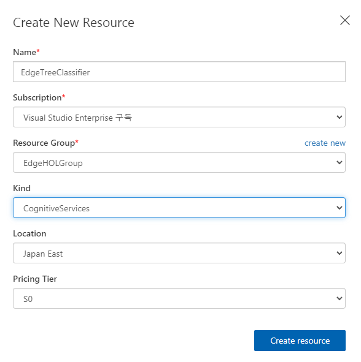
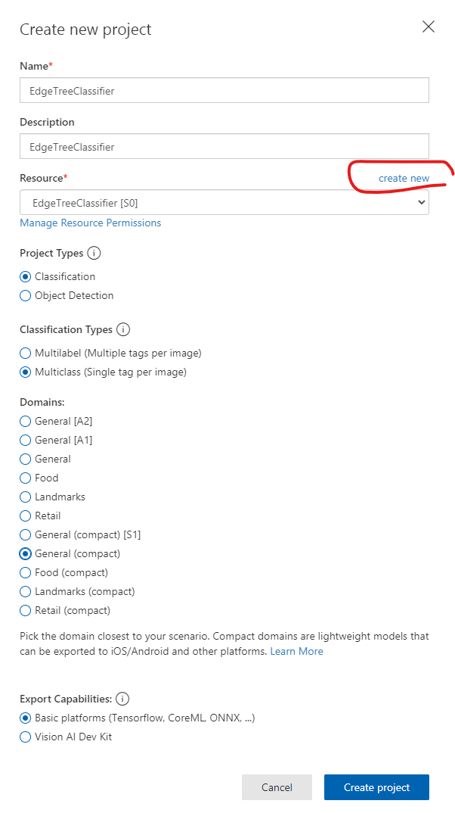
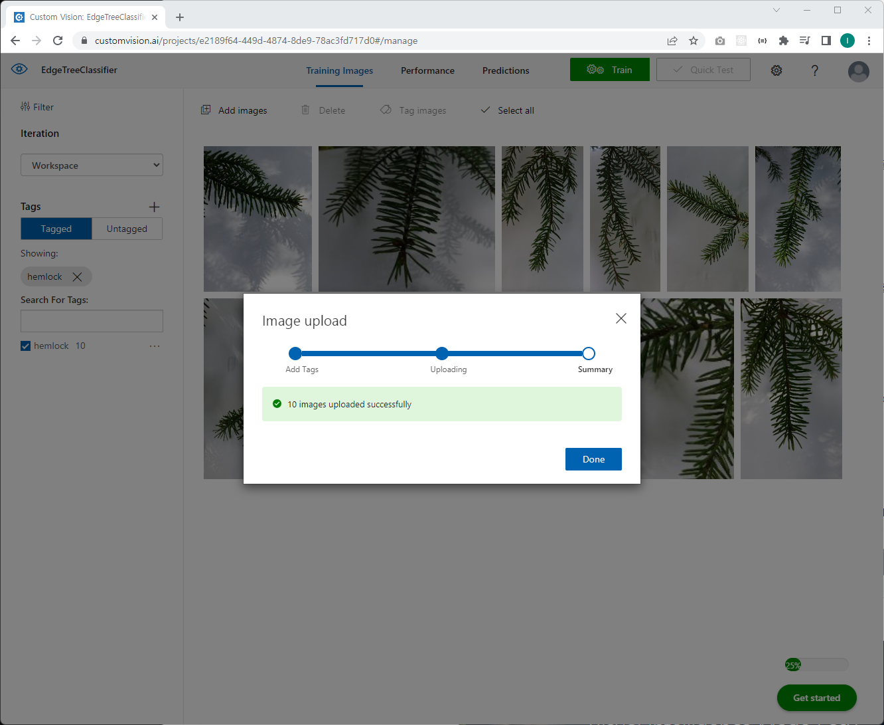
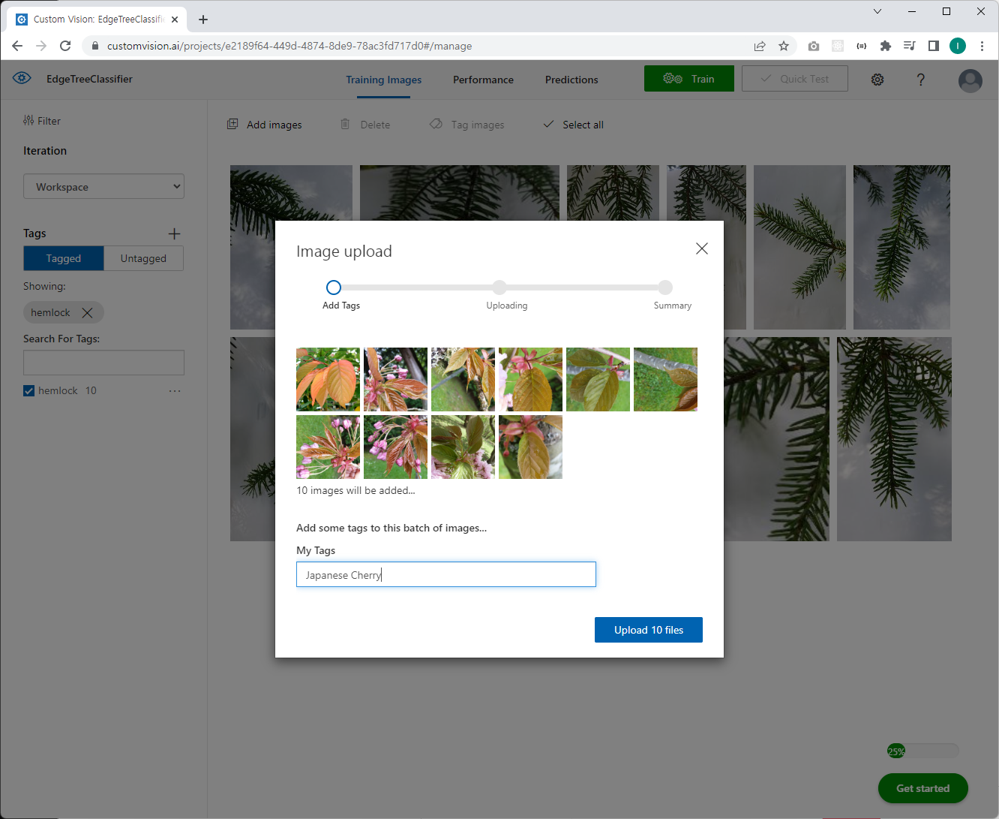
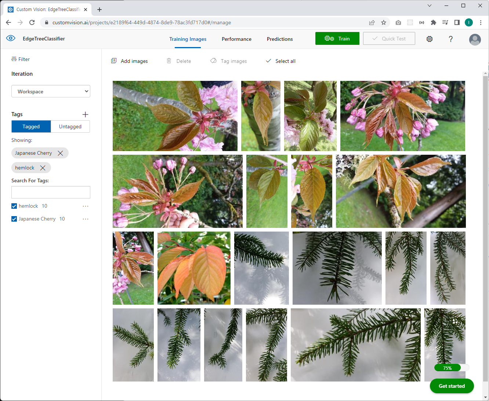
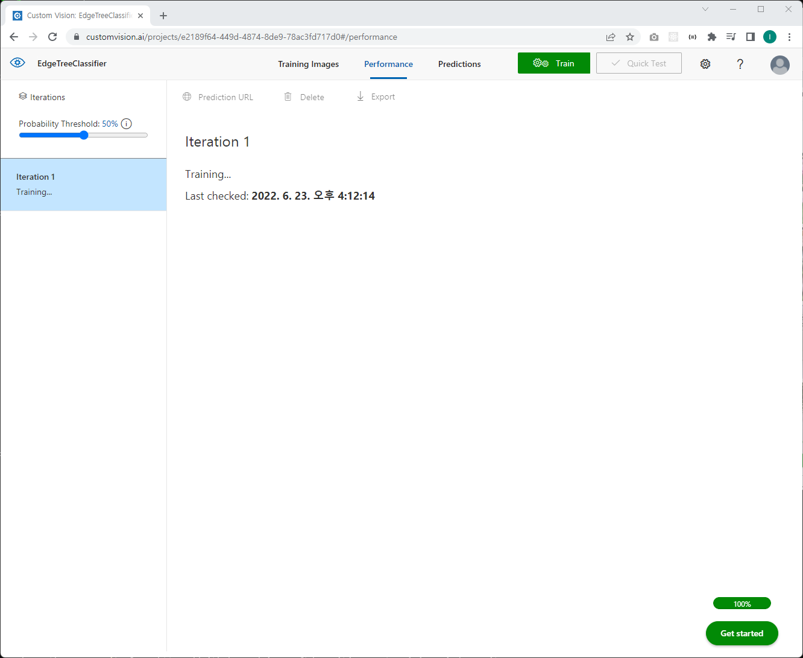

# Azure IoT Edge - Intelligment Lab (60분)

Lab2까지 완료했다면 이미 Azure IoT Edge를 관리 및 배포하고 개발하는 기본 방법은 모두 익혔습니다. Azure IoT Edge의 여러 주제 가운데 AI 기능을 Edge에 배포하여 실행(Inferencing)시키는 주제가 있습니다. 

실습에서는 Azure Docs에 있는 자습서로 진행하겠습니다. 

[자습서: Custom Vision Service를 사용하여 에지에서 이미지 분류 수행](https://docs.microsoft.com/ko-kr/azure/iot-edge/tutorial-deploy-custom-vision?view=iotedge-2020-11)

## Step 1: [Custom Vision을 사용하여 이미지 분류자 빌드](https://docs.microsoft.com/ko-kr/azure/iot-edge/tutorial-deploy-custom-vision?view=iotedge-2020-11#build-an-image-classifier-with-custom-vision)

### 힌트 

1. Custom Vision에서 새 프로젝트 만들기 

    

    

    General (compact) 로 선택

1. 이미지 업로드 

    

    

    

1. Training (quick)

    

1. 이미지 분류자 추가

    module.json
    ```json
    {
    "$schema-version": "0.0.1",
    "description": "",
    "image": {
        "repository": "edgeholacr004.azurecr.io/classifier",
        "tag": {
        "version": "0.0.1",
        "platforms": {
            "amd64": "./Dockerfile"
        }
        },
        "buildOptions": [],
        "contextPath": "./"
    },
    "language": "python"
    }
    ```

    requirements.txt
    ```
    azure-iot-device~=2.7.0
    requests
    ```

    deployment.template.json
    ```json
    {
    "$schema-template": "4.0.0",
    "modulesContent": {
        "$edgeAgent": {
        "properties.desired": {
            "schemaVersion": "1.1",
            "runtime": {
            "type": "docker",
            "settings": {
                "minDockerVersion": "v1.25",
                "loggingOptions": "",
                "registryCredentials": {
                "edgeholacr004": {
                    "username": "$CONTAINER_REGISTRY_USERNAME_edgeholacr004",
                    "password": "$CONTAINER_REGISTRY_PASSWORD_edgeholacr004",
                    "address": "edgeholacr004.azurecr.io"
                }
                }
            }
            },
            "systemModules": {
            "edgeAgent": {
                "type": "docker",
                "settings": {
                "image": "mcr.microsoft.com/azureiotedge-agent:1.2",
                "createOptions": {}
                }
            },
            "edgeHub": {
                "type": "docker",
                "status": "running",
                "restartPolicy": "always",
                "settings": {
                "image": "mcr.microsoft.com/azureiotedge-hub:1.2",
                "createOptions": {
                    "HostConfig": {
                    "PortBindings": {
                        "5671/tcp": [
                        {
                            "HostPort": "5671"
                        }
                        ],
                        "8883/tcp": [
                        {
                            "HostPort": "8883"
                        }
                        ],
                        "443/tcp": [
                        {
                            "HostPort": "443"
                        }
                        ]
                    }
                    }
                }
                }
            }
            },
            "modules": {
            "classifier": {
                "version": "1.0",
                "type": "docker",
                "status": "running",
                "restartPolicy": "always",
                "settings": {
                "image": "${MODULES.classifier}",
                "createOptions": {}
                }
            },
            "cameraCapture": {
                "version": "1.0",
                "type": "docker",
                "status": "running",
                "restartPolicy": "always",
                "settings": {
                "image": "${MODULES.cameraCapture}",
                "createOptions": "{\"Env\":[\"IMAGE_PATH=test_image.jpg\",\"IMAGE_PROCESSING_ENDPOINT=http://classifier/image\"]}"
                }
            }
            }
        }
        },
        "$edgeHub": {
        "properties.desired": {
            "schemaVersion": "1.1",
            "routes": {
            "cameraCaptureToIoTHub": "FROM /messages/modules/cameraCapture/outputs/* INTO $upstream"
            },
            "storeAndForwardConfiguration": {
            "timeToLiveSecs": 7200
            }
        }
        }
    }
    }
    ```
1. IoT Edge 솔루션 빌드 및 푸시

    가상머신에서 배포 과정 로그 보기 
    ```
    $ iotedge logs edgeAgent -f
    ...
    <6> 2022-06-23 07:52:06.324 +00:00 [INF] - Plan execution started for deployment 4
    <6> 2022-06-23 07:52:06.324 +00:00 [INF] - Executing command: "Stop module SimulatedTemperatureSensor"
    <6> 2022-06-23 07:52:06.664 +00:00 [INF] - Executing command: "Stop module SampleModule"
    <6> 2022-06-23 07:52:07.012 +00:00 [INF] - Executing command: "Remove module SimulatedTemperatureSensor"
    <6> 2022-06-23 07:52:07.057 +00:00 [INF] - Executing command: "Remove module SampleModule"
    <6> 2022-06-23 07:52:07.185 +00:00 [INF] - Executing command: "Saving SimulatedTemperatureSensor to store"
    <6> 2022-06-23 07:52:07.185 +00:00 [INF] - Executing command: "Saving SampleModule to store"
    <6> 2022-06-23 07:52:07.186 +00:00 [INF] - Executing command: "Command Group: (\n  [Command Group: (\n  [Prepare module classifier]\n  [Create module classifier]\n)]\n  [Start module classifier]\n)"
    <6> 2022-06-23 07:52:07.186 +00:00 [INF] - Executing command: "Command Group: (\n  [Prepare module classifier]\n  [Create module classifier]\n)"
    <6> 2022-06-23 07:52:34.506 +00:00 [INF] - Executing command: "Start module classifier"
    <6> 2022-06-23 07:52:35.032 +00:00 [INF] - Executing command: "Command Group: (\n  [Command Group: (\n  [Prepare module cameraCapture]\n  [Create module cameraCapture]\n)]\n  [Start module cameraCapture]\n)"
    <6> 2022-06-23 07:52:35.032 +00:00 [INF] - Executing command: "Command Group: (\n  [Prepare module cameraCapture]\n  [Create module cameraCapture]\n)"
    <6> 2022-06-23 07:52:42.787 +00:00 [INF] - Executing command: "Start module cameraCapture"
    <6> 2022-06-23 07:52:43.314 +00:00 [INF] - Plan execution ended for deployment 4
    <6> 2022-06-23 07:52:43.498 +00:00 [INF] - Updated reported properties
    <6> 2022-06-23 07:52:48.522 +00:00 [INF] - Plan execution started for deployment 4
    <6> 2022-06-23 07:52:48.523 +00:00 [INF] - Executing command: "Command Group: (\n  [Stop module classifier]\n  [Start module classifier]\n  [Saving classifier to store]\n)"
    <6> 2022-06-23 07:52:48.523 +00:00 [INF] - Executing command: "Stop module classifier"
    <6> 2022-06-23 07:52:48.528 +00:00 [INF] - Executing command: "Start module classifier"
    <6> 2022-06-23 07:52:49.074 +00:00 [INF] - Executing command: "Saving classifier to store"
    <6> 2022-06-23 07:52:49.077 +00:00 [INF] - Plan execution ended for deployment 4
    <6> 2022-06-23 07:52:49.257 +00:00 [INF] - Updated reported properties
    <6> 2022-06-23 07:52:54.271 +00:00 [INF] - Module 'classifier' scheduled to restart after 20s (15s left).
    <6> 2022-06-23 07:52:54.406 +00:00 [INF] - Updated reported properties
    <6> 2022-06-23 07:52:59.417 +00:00 [INF] - Module 'classifier' scheduled to restart after 20s (10s left).
    <6> 2022-06-23 07:53:04.429 +00:00 [INF] - Module 'classifier' scheduled to restart after 20s (05s left).
    <6> 2022-06-23 07:53:09.442 +00:00 [INF] - Module 'classifier' scheduled to restart after 20s (00s left).
    <6> 2022-06-23 07:53:14.453 +00:00 [INF] - Plan execution started for deployment 4
    <6> 2022-06-23 07:53:14.453 +00:00 [INF] - Executing command: "Command Group: (\n  [Stop module classifier]\n  [Start module classifier]\n  [Saving classifier to store]\n)"
    <6> 2022-06-23 07:53:14.453 +00:00 [INF] - Executing command: "Stop module classifier"
    <6> 2022-06-23 07:53:14.457 +00:00 [INF] - Executing command: "Start module classifier"
    <6> 2022-06-23 07:53:14.964 +00:00 [INF] - Executing command: "Saving classifier to store"
    <6> 2022-06-23 07:53:14.973 +00:00 [INF] - Plan execution ended for deployment 4
    <6> 2022-06-23 07:53:20.039 +00:00 [INF] - Module 'classifier' scheduled to restart after 40s (35s left).
    <6> 2022-06-23 07:53:20.176 +00:00 [INF] - Updated reported properties
    ```

1. 디바이스에 모듈 배포 

    배포 확인 
    ```
    $ iotedge list
    NAME             STATUS           DESCRIPTION                CONFIG
    cameraCapture    running          Up 2 minutes               edgeholacr004.azurecr.io/cameracapture:0.0.1-amd64
    classifier       failed           Failed (1) 25 seconds ago  edgeholacr004.azurecr.io/classifier:0.0.1-amd64
    edgeAgent        running          Up 2 hours                 mcr.microsoft.com/azureiotedge-agent:1.2
    edgeHub          running          Up 2 hours                 mcr.microsoft.com/azureiotedge-hub:1.2
    ```

1. 분류 결과 보기

    ```
    ```