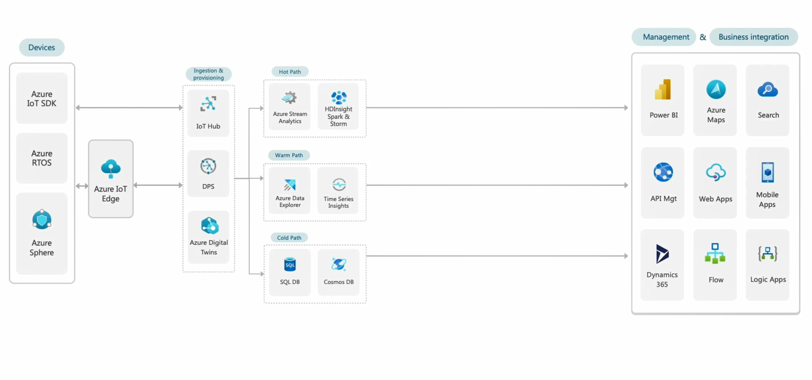

# Azure IoT Hub, Device Provisioning Service Hands-on Lab 

## Reference Arch 
 1. [Azure IoT Architecure 문서](https://aka.ms/AzureIoTArch)
 1. IoT와 관련된 서비스(IoT Hub / DPS)

 
 

## 1. Portal에서 IoT Hub 만들기

 1. [참고문서](https://docs.microsoft.com/ko-kr/azure/iot-hub/iot-hub-create-through-portal)
 1. Tire Standard vs Basic, Unit의 개념, [Azure IoT Hub 가격표](https://azure.microsoft.com/ko-kr/pricing/details/iot-hub/)
 1. 파티션 갯수는 만들때 만 정할 수 있다
 1. SAS vs RBAC / Private Link
 1. IoT Hub에 디바이스를 하나 등록하고 Connection String을 복사해 놓는다.

## 2. 디바이스 시뮬레이션 부터 시작 

 1. [Azure IoT Hub SDK](https://github.com/Azure/azure-iot-sdks). C, C#, Javascript, Python, Java. 디바이스가 보통은 MCU 라서 C를 많이 쓴다.
 1. 가끔 리눅스가 있다. 가끔 RPi를 쓰는 경우가 있다. 이런 경우에는 Javascript, Python이 좋은 옵션  
 1. MQTT, AMQP, HTTPS 3가지 프로토콜 지원. 우선 알 필요없다. SDK를 쓰면 된다. 
 1. Javascript SDK 를 이용한 디바이스 시뮬레이션 작성 
   1) D2C 메시지 보내기 / Connection String
   2) [Azure IoT Explorer](https://docs.microsoft.com/ko-kr/azure/iot-fundamentals/howto-use-iot-explorer)에서 받기 

## 3. DPS(Device Provisioning Service)의 등장 

 1. 왜 필요한지? 운영까지 생각하면 필수.
 1. 작동 방식은? 
 1. DPS 만들기 / IoT Hub 연결 / 그룹 Enrollment / Individual Enrollment [참고문서](https://docs.microsoft.com/ko-kr/azure/iot-dps/quick-create-simulated-device-symm-key?pivots=programming-language-nodejs)
 1. 샘플코드 추가해서 Provisioning 
 1. 사례

 ```powershell
 PS> npm install 
 PS> node .\1_send_telemetry.js
 ```

## 4. Warm Path의 구현 
 1. Function으로 트리거 받아서 Warm Path (Azure function IoT Hub trigger 로 검색)
 1. DB 만들어서 Insert
 1. DB는 어떤것이 가능한가? NoSQL, SQL Database, MySQL 

## 5. Message Routing을 통한 Cold Path 
 1. Storage 또는 Data Lake 로 바로 넣어주는 Route, 메시지를 동시에 Built-in endpoint로 넣으려면 하나 더 만들어줘야 한다. 
 1. Event Hub 거쳐서 ADX / TSI 로 넣어주거나 
 1. 그대로 말고 파싱을 해서 정리해서 주고 싶다면 Function 에서 파싱하고 Event Hub에 넣어줌. 
 1. [참고자료, Azure Stream Analytics를 사용하여 실시간 IoT 데이터 스트림 처리](https://docs.microsoft.com/ko-kr/azure/iot-hub/tutorial-routing)

## 6. Stream Analytics 를 통한 Hot Path 
 1. ASA 만들기 
 1. Input / output / Query 
 1. [참고자료, Azure Stream Analytics를 사용하여 실시간 IoT 데이터 스트림 처리](https://docs.microsoft.com/ko-kr/azure/stream-analytics/stream-analytics-get-started-with-azure-stream-analytics-to-process-data-from-iot-devices)

## 7. IoT Hub의 통신 방식
 1. 그림 
 1. C2D Callback 을 시뮬레이터에서 만들고 Explorer 에서 보내기 
 1. Direct Method를 시뮬레이터에 만들고 Explorer에서 보내기 
 1. Device Twin의 개념
 1. Device Twin 콜백 만들어서 Explorer에 보내기 

## 8. IoT Hub Management 코드
 1. C2D 
 1. Direct Method 
 1. Desired Properties 

## 9. Connected / Disconnected 이벤트 (EventGrid)

 1. Event Grid 설정 및 Function Code 
 1. 이벤트를 받을때까지 시간이 걸림